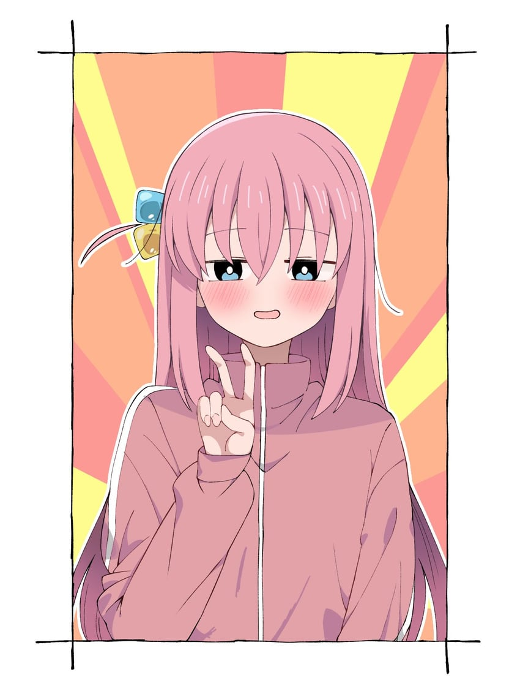
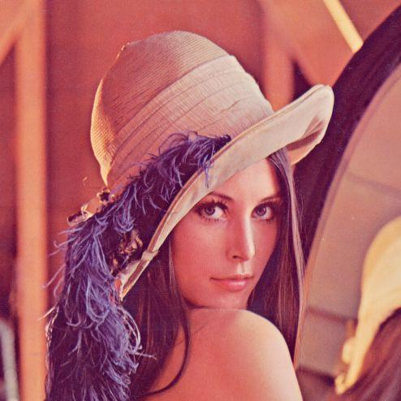
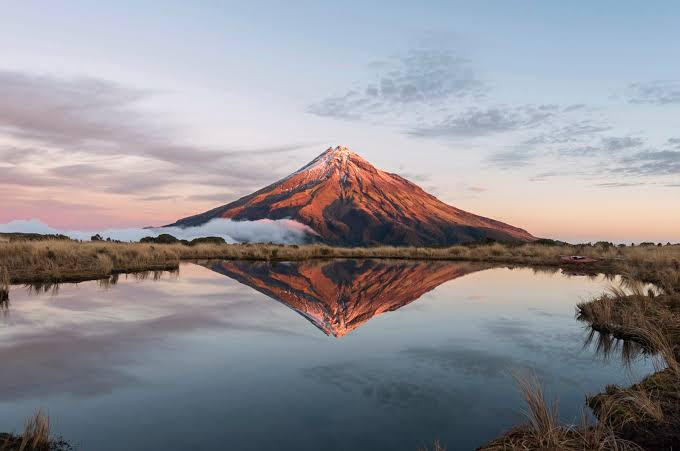
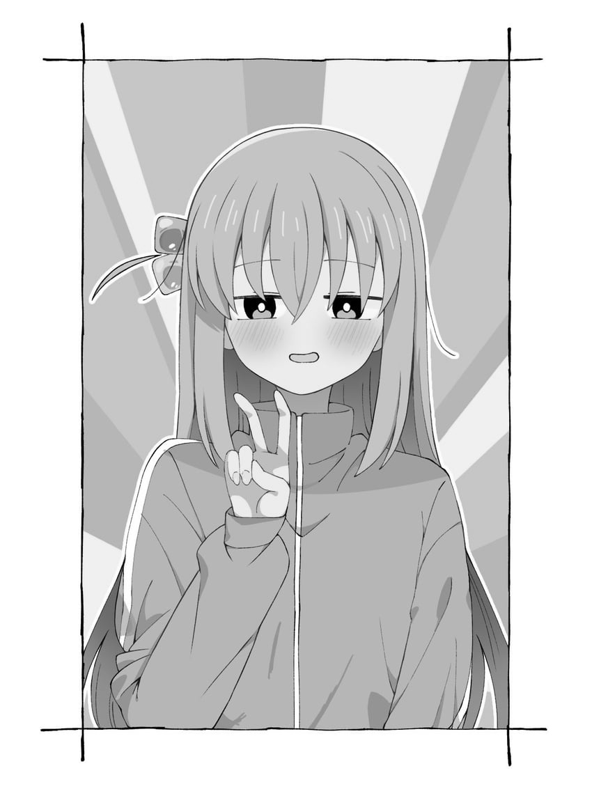
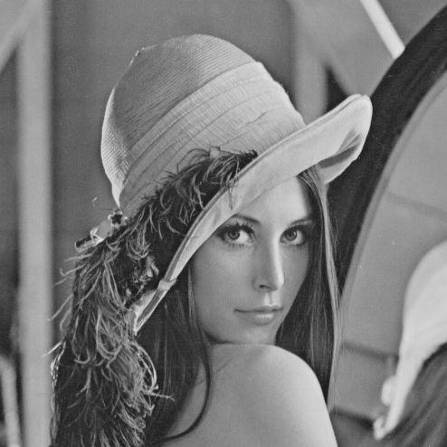
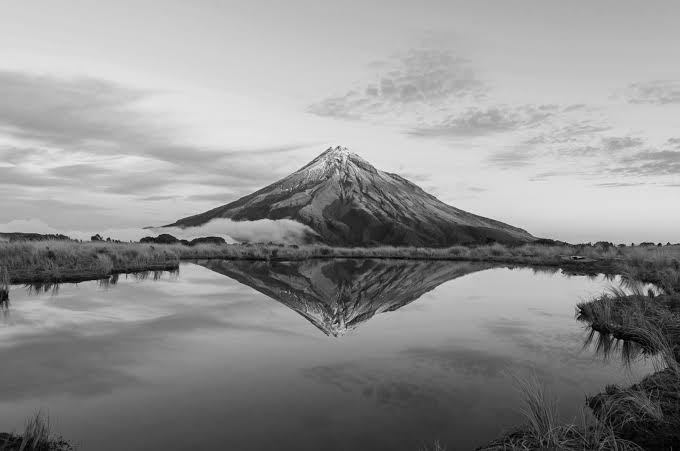
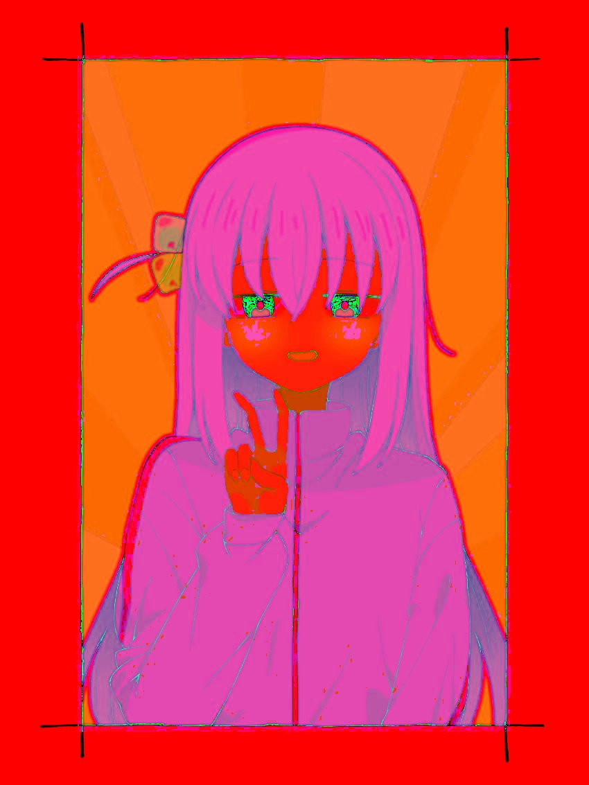
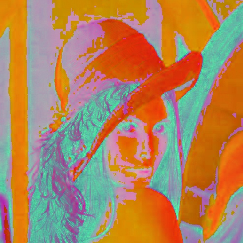
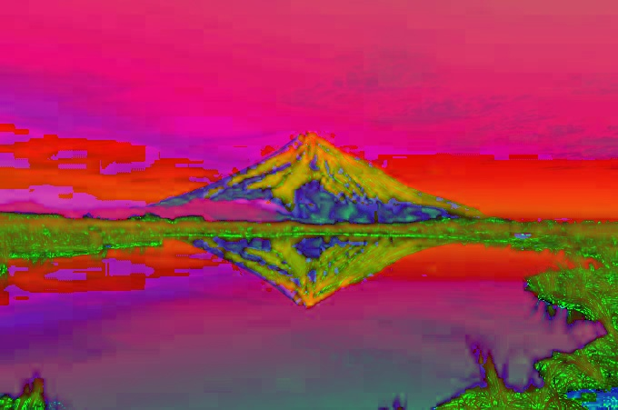
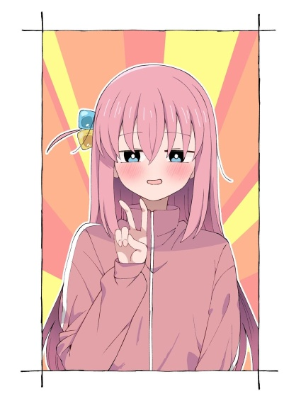

# 数组

定义：在计算机内存中连续存储、具有固定维度结构的数据集合，通过索引访问元素。

简要理解：在计算机视觉中的数组（当然在这里暂时悬置维数问题）可以用于表示一个图片的一切（所有的像素点的内容的集合）  
同时，一个像素点也可能是一个数组（作为大数组的一部分）  
P(x , y)=​[R，G，B​​]

# 矩阵

定义：按行和列排列的二维数据结构。
$$
A=
\begin{bmatrix}
1 & 4\\
2 & 5\\
3 & 6
\end{bmatrix}
$$
讲解的意义有限，在这里更多是用于展示或者纯粹的数学工具使用

# 像素

定义：像素是数字图像中空间采样的最小单位。

简要理解：组成图像中的一个个像素点

# 分辨率

定义：图像在水平和垂直方向上的采样数量。

简要理解：一张图像在XY方向上由多少个像素点组合而成

# 灰度图

定义：每个像素只表示亮度，不表示颜色的图像。

简要理解：黑白图片，抛开rgb颜色，每个像素点只有一个数据-》亮度

# RGB BGR HSV

# RGB
定义：Red Green Blue 红绿蓝组合显色

备注：3

# BGR
定义：OpenCV中的RGB变体

实际意义：在opencv中的实际使用的rgb排版格式
即RGB：`[255, 0, 0]`
实际OpenCV存储：`[0, 0, 255]`

# HSV
定义：
H = Hue（色相）
S = Saturation（饱和度）
V = Value（明度）

实际意义：
H -》色彩在色环上面的位置
色环：
```text
                         红
                      0° / 360°


             品红                     黄
             300°                    60°


        蓝                                 绿
       240°                               120°


                         青
                        180°
```

S-》颜色距离灰色的程度。(S=高 纯颜色-》S=低 灰白颜色)

V-》颜色整体有多亮。

RGB 和 HSV转化 
# RGB → HSV 转换过程

---

## Step 1: RGB 归一化（Normalization）

将 8-bit RGB：

$$
(R,G,B)\in[0,255]
$$

转换为：

$$
(R',G',B')\in[0,1]
$$

计算：

$$
R'=\frac{R}{255},\qquad
G'=\frac{G}{255},\qquad
B'=\frac{B}{255}
$$


---

## Step 2: 求最大值与最小值

$$
C_{\max}=\max(R',G',B')
$$

$$
C_{\min}=\min(R',G',B')
$$

颜色差：

$$
\Delta=C_{\max}-C_{\min}
$$


---

## Step 3: Value（明度）

$$
V=C_{\max}
$$


---

## Step 4: Saturation（饱和度）

$$
S=
\begin{cases}
0, & C_{\max}=0\\
\dfrac{\Delta}{C_{\max}}, & C_{\max}\neq0
\end{cases}
$$


---

## Step 5: Hue（色相）

$$
H=
\begin{cases}
0, & \Delta=0\\[8pt]

60^\circ
\left(
\bmod\left(\frac{G'-B'}{\Delta},6\right)
\right),
& C_{\max}=R'
\\[12pt]

60^\circ
\left(
\frac{B'-R'}{\Delta}+2
\right),
& C_{\max}=G'
\\[12pt]

60^\circ
\left(
\frac{R'-G'}{\Delta}+4
\right),
& C_{\max}=B'
\end{cases}
$$


---

## 最终 HSV 表示

$$
HSV=(H,S,V)
$$
# 图像实验

## 读取单个图片实验

```
import cv2 #引入opencv

img = cv2.imread("images/anime.jpg") #给出路径

print(img) #输出
```


结果：

解释：每一个`[255,255,255]`都是BGR（opencv的格式）的组合，而255,255,255指的正是白色像素点

## 读取多个图像并输出输出尺寸、通道数、像素值范围实验
原代码（粗暴版本）：
```
import cv2

img = cv2.imread("images/anime.jpg")

print(img) 

img = cv2.imread("images/lenna.jpg")

print(img)

img = cv2.imread("images/scenery.jpg")

print(img)
```

结果：略，可以参考上一个实验
但是这样的实验结果有些过于粗糙，让我们进行优化
优化后（使用列表进行输入，输出改为图片路径与图片的数据格式）：
```
import cv2

image_paths = [           #将image_paths作为列表，存入图片的路径
    "images/anime.jpg",
    "images/lenna.jpg",
    "images/scenery.jpg"
]

for path in image_paths:   #循环将image_paths的内容赋值给path
    img = cv2.imread(path) #img是读取path路径对应的图像
    print(path)            #输出path
    print(img.shape)       #输出path对应的图片的数据格式（高，宽，通道）
    print(img.min())       #输出像素值最低值
    print(img.max())       #输出像素值最高值
```
结果：

### 灰度图
```
import cv2

import os

image_paths = [
    "images/anime.jpg",
    "images/lenna.jpg",
    "images/scenery.jpg"
]

for path in image_paths:

    img = cv2.imread(path)
    
    gray = cv2.cvtColor(img,cv2.COLOR_BGR2GRAY) #将img对应的图片转换为灰度图
    filename = os.path.basename(path)           #获取path的文件名
    name, ext = os.path.splitext(filename)      #name和ext分别是文件名和后缀名
    
    cv2.imwrite(                                #输出灰度图，这里也可以写作一行
    f"output/{name}_gray{ext}",                 #路径
    gray                                        #灰度图内容
    )

    print(path)
    print(img.shape)
    print(img.min())       
    print(img.max())       
```


## HSV图片
```
import cv2
import os

image_paths = [
    "images/anime.jpg",
    "images/lenna.jpg",
    "images/scenery.jpg"
]

for path in image_paths:

    img = cv2.imread(path)
    gray = cv2.cvtColor(img,cv2.COLOR_BGR2GRAY) 
    hsv = cv2.cvtColor(img,cv2.COLOR_BGR2HSV)   #将img对应的图片转换为HSV图片
    filename = os.path.basename(path)
    name, ext = os.path.splitext(filename)
    cv2.imwrite(f"output/{name}_gray{ext}",gray)
    
    cv2.imwrite(                          #输出HSV图，这里也可以写作一行
    f"output/{name}_hsv{ext}",            #路径
    hsv                                   #HSV图内容
    )
    print(path)
    print(img.shape)
    print(img.min())       
    print(img.max())   
```
结果：


## 缩放图
```
import cv2
import os
image_paths = [
    "images/anime.jpg",
    "images/lenna.jpg",
    "images/scenery.jpg"
]

for path in image_paths:
    img = cv2.imread(path)
    gray = cv2.cvtColor(img,cv2.COLOR_BGR2GRAY)
    hsv = cv2.cvtColor(img,cv2.COLOR_BGR2HSV)
    resize = cv2.resize(                      #将img对应的图片进行缩放转换（可缩一行）
    img,                                      #输入图片
    None,                                     #指定的输出尺寸，在这里不用
    fx=0.5,                                   #宽度缩放比例
    fy=0.5                                    #高度缩放比例
    )
    filename = os.path.basename(path)
    name, ext = os.path.splitext(filename)
    cv2.imwrite(f"output/{name}_gray{ext}",gray)
    cv2.imwrite(f"output/{name}_hsv{ext}",hsv)
    cv2.imwrite(                              #输出缩放图，这里也可以写作一行
    f"output/{name}_resize{ext}",             #路径
    resize                                    #图像内容
    )
    print(path)
    print(img.shape)
    print(img.min())
    print(img.max())
```
结果：



## 项目化
最终在进行仓库纳入之后，发现先前的代码的内容未考虑项目化之后的路径寻找问题，为了解决该问题，对代码进行修改，并做出一定优化
```
import cv2
from pathlib import Path
import os

BASE_DIR = Path(__file__).resolve().parent   # 获取当前py文件所在目录
IMAGE_DIR = BASE_DIR / "images"
OUTPUT_DIR = BASE_DIR / "output"             # 输出目录

image_paths = [
    IMAGE_DIR / "anime.jpg",
    IMAGE_DIR / "lenna.jpg",
    IMAGE_DIR / "scenery.jpg"
]

for path in image_paths:
    img = cv2.imread(str(path))
    gray = cv2.cvtColor(img,cv2.COLOR_BGR2GRAY)
    hsv = cv2.cvtColor(img,cv2.COLOR_BGR2HSV)
    resize = cv2.resize(img,None,fx=0.5,fy=0.5)

    filename = os.path.basename(path)
    name, ext = os.path.splitext(filename)

    cv2.imwrite(str(OUTPUT_DIR / f"{name}_gray{ext}"),gray)
    cv2.imwrite(str(OUTPUT_DIR / f"{name}_hsv{ext}"),hsv)
    cv2.imwrite(str(OUTPUT_DIR / f"{name}_resize{ext}"),resize)

    print(path)
    print(img.shape)
    print(img.min(),img.max())
```
