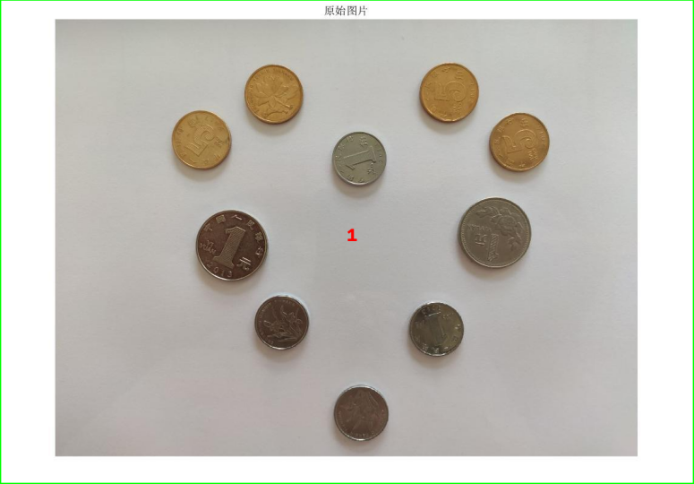
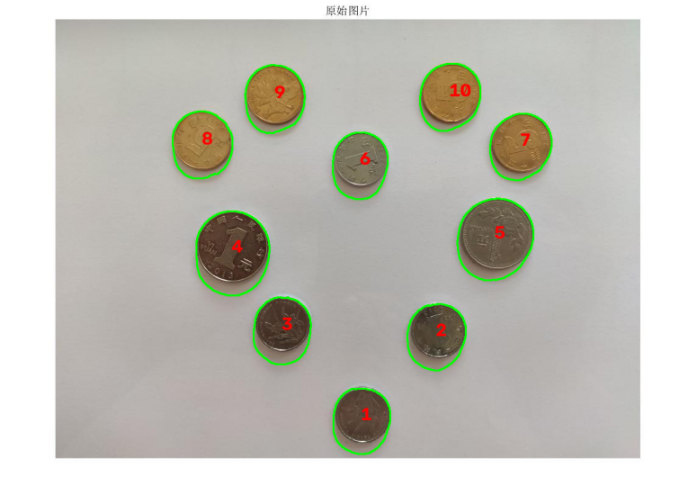

# 灰度变换

定义： 灰度变换是将图像像素的灰度值按照某种数学关系重新映射，从而改变图像亮度、对比度的过程。

理解：针对**灰度图**修改每一个像素点的亮度值。

## 常见方式

###  线性灰度变换
公式：

  g(x,y)=af(x,y)+b
- `f(x,y)`：原像素值
- `g(x,y)`：变换后的像素值
- `a`：控制对比度
- `b`：控制亮度

用处：
- 对比度提高
- 图片更清晰
### 阈值变换（二值化）
设置阈值（例如150），以将灰度图极化（通常是255/0）

常用于：
- 文字识别
- 目标分割

# 直方图均衡

定义：直方图均衡是一种通过重新分配像素灰度，使图像灰度分布更加均匀，从而增强对比度的方法。

关联：直方图
对于灰度图：统计每一个灰度值出现了多少次。

理解：直方图均衡的目的在于避免直方图中灰度图可能对比度不明显的问题（例如原本存在1234四种灰度的图，不够直观，将其变成25 50 75 100,增加对比度),让暗的和亮的更明显

应用：

- 医学影像
- 夜间增强
- 人脸识别
# 平滑去噪

定义：平滑去噪是利用滤波方法减少图像中的随机噪声，同时尽量保持图像结构的过程。

理解：这其实是一个类，包含很多种方法
核心思想在于通过看领域来补全噪点的值
## 常见滤波

### 均值滤波
用周围像素平均值替代当前像素。
效果：
- 去噪
- 但是边缘模糊
###  高斯滤波
中心像素权重更大。
用一个钟形曲线决定邻居贡献程度。
代码为 
```
blur=cv2.GaussianBlur(
    img,                     #对象图片
    (5,5),                   #滤波窗口
    0                        #高斯核的标准差设置为0，让 OpenCV 自动计算。
)
```
### 中值滤波
取邻域中间值
用处：
椒盐噪声（突然出现黑点、白点）

# Sobel/Canny

## Sobel 
定义：Sobel 是一种利用梯度变化检测图像边缘的方法。

理解：像素变化剧烈的位置。
代码:cv2.Sobel()

## Canny 
定义：Canny 是一种多阶段边缘检测算法，用于更加准确地提取物体边缘。

步骤：
高斯滤波 → 梯度计算   → 非极大值抑制    → 双阈值检测     →  边缘连接
(去噪)         (寻找变化)  (边缘细化保证一条线)  (强/弱边缘分类)  (对弱边缘最终判断)

# 腐蚀
定义：腐蚀通过缩小白色区域，使目标边界向内收缩。

理解：窗口内都是白色的话，就只保留核心像素点为白色

# 膨胀
定义：膨胀扩大白色区域，使目标边界向外扩张。

理解：反向腐蚀

# 开运算（Opening）
定义：先腐蚀，再膨胀

作用：
去除小噪点。
# 闭运算（Closing）
先膨胀，再腐蚀。

作用：填补小孔。

# 轮廓提取（Contour Extraction）
定义：轮廓提取是寻找图像中物体边界曲线的过程。

理解：更像是一个概括性的总结，是很多方式的指代，而不是一个明确的术语

# 实验记录
## 实验内容：硬币数量统计与定位

问题分析：对一张包含多个硬币/零件的图片进行处理，自动检测目标，并统计数量。

事先思路构想：通过图像处理方法提取图像中的硬币区域，根据目标的形状和位置特征进行识别，并对检测到的目标进行数量统计和结果标记。

实验原理/实验步骤：
灰度化 → 滤波 → 二值化 → 形态学处理（先开运算，后闭运算） → 轮廓检测函数 → 计数定位

## 第一版（鲁棒性差，且有致命问题）
```
import cv2
import matplotlib.pyplot as plt
from pathlib import Path

BASE_DIR = Path(__file__).resolve().parent  #读取和保存路径
IMAGE_DIR = BASE_DIR / "images"
OUTPUT_DIR = BASE_DIR / "output"
image_path = IMAGE_DIR / "coins.png"

img = cv2.imread(str(image_path))            #读入待处理的图片

gray = cv2.cvtColor(                         #灰度化
    img,                                     #对象图像
    cv2.COLOR_BGR2GRAY                       #颜色转换方式（灰度化）
)

blur = cv2.GaussianBlur(                     #高斯滤波
    gray,                                    #对象图像
    (5,5),                                   #卷积核
    0                                        #高斯核标准差，置0以自动计算
)

_, thresh = cv2.threshold(                   #由于只需要二值化之后的图像所以第一个返回值空置不用
    blur,                                    #对象图像
    120,                                     #阈值
    255,                                     #满足阈值之后的值化值
    cv2.THRESH_BINARY                        #值化规则
)

kernel = cv2.getStructuringElement(          #准备窗口
    cv2.MORPH_ELLIPSE,                       #指定形状为椭圆形（圆形窗口更多用于平均滤波）
    (5,5)                                    #准备窗口
)

closed = cv2.morphologyEx(                   #闭运算
    thresh,                                  #对象图像
    cv2.MORPH_CLOSE,                         #闭运算
    kernel                                   #窗口
)

contours, _ = cv2.findContours(              #由于只需要轮廓列表，所以第二个返回值空置
    closed,                                  #对象图像
    cv2.RETR_EXTERNAL,                       #只寻找最外层轮廓
    cv2.CHAIN_APPROX_SIMPLE                  #删除冗余点，只保留关键点
)

result = img.copy()                          #制作一个副本以供后续的绘制和修改

count = 0                                    #进行计数
for contour in contours:                     #遍历路口列表
    area = cv2.contourArea(contour)          #计算轮廓面积
    if area > 500:                           #轮廓符合标准时候进行计数
        count += 1
        cv2.drawContours(                    #绘制轮廓
            result,                          #目标图像
            [contour],                       #构造一个只有一个元素的列表
            -1,                              #绘制列表里所有轮廓（但是↑所以只有当前这个轮廓）
            (0,255,0),                       #BGR模式绘制，使用绿色绘制
            2                                #2单位线宽
        )
        M = cv2.moments(contour)             #计算轮廓矩，用于计算面积、重心、中心坐标
        cx = int(                            #计算中心点 x
            M["m10"]/M["m00"]
        )
        cy = int(                            #计算中心点 y
            M["m01"]/M["m00"]
        )
        cv2.putText(                         #绘制文字编号
            result,
            str(count),                      #使用计数直接作为编号
            (cx,cy),                         #坐标
            cv2.FONT_HERSHEY_SIMPLEX,        #OpenCV内置字体
            1,                               #字体大小
            (0,0,255),                       #BGR，红色
            2                                #文字粗细
        )

print(                                       #输出文字结果
    "检测数量:",
    count
)

result_rgb = cv2.cvtColor(                   #把BGR变回RGB
    result,
    cv2.COLOR_BGR2RGB
)

plt.figure(figsize=(10,8))                  #创建绘图窗口
plt.imshow(result_rgb)                      #绘图窗口汇入
plt.axis("off")                             #关闭坐标轴显示
plt.savefig(str(OUTPUT_DIR / "result_wrong.png"), bbox_inches="tight", pad_inches=0)                               #保存结果
plt.close()                                 #关闭绘图对象
```
结果：

这样就有些明显错误了
由于这张图片中，既存在白色的背景，又存在灰色的背景，图片背景是浅色白色，硬币是较暗区域
而 `findContours()` 默认寻找白色区域轮廓，所以它找到的是：大面积背景，而不是硬币
所以应该使用反二值化，而且也将阈值放弃定死在120的策略

## 第二版
```
import cv2
import matplotlib.pyplot as plt
from pathlib import Path

BASE_DIR = Path(__file__).resolve().parent   #读取和保存路径
IMAGE_DIR = BASE_DIR / "images"
OUTPUT_DIR = BASE_DIR / "output"  
image_path = IMAGE_DIR / "coins.png"

img = cv2.imread(str(image_path))             #读入待处理的图片

if img is None:                               #判断图片是否读取成功
    print("读取失败")
    exit()

gray = cv2.cvtColor(                         #灰度化
    img,                                     #对象图像
    cv2.COLOR_BGR2GRAY                       #颜色转换方式（灰度化）
)

blur = cv2.GaussianBlur(                     #高斯滤波
    gray,                                    #对象图像
    (5,5),                                   #卷积核
    0                                        #高斯核标准差，置0以自动计算
)

_, thresh = cv2.threshold(                   #由于只需要二值化之后的图像所以第一个返回值空置不用
    blur,                                    #对象图像
    150,                                     #阈值
    255,                                     #满足阈值之后的值化值
    cv2.THRESH_BINARY_INV                    #反向二值化，使目标区域变为白色以回避上一版的问题
)

kernel = cv2.getStructuringElement(          #准备窗口
    cv2.MORPH_ELLIPSE,                       #指定形状为椭圆形，更适合处理圆形硬币
    (3,3)                                    #准备窗口
)

clean = cv2.morphologyEx(                    #开运算
    thresh,                                  #对象图像
    cv2.MORPH_OPEN,                          #开运算：先腐蚀后膨胀，用于去除小噪声
    kernel                                   #窗口
)


clean = cv2.morphologyEx(                    #闭运算
    clean,                                   #对象图像
    cv2.MORPH_CLOSE,                         #闭运算：先膨胀后腐蚀，用于填补目标内部空缺
    kernel                                   #窗口
)

contours,_ = cv2.findContours(               #由于只需要轮廓列表，所以第二个返回值空置
    clean,                                   #对象图像
    cv2.RETR_EXTERNAL,                       #只寻找最外层轮廓
    cv2.CHAIN_APPROX_SIMPLE                  #删除冗余点，只保留关键点
)

result = img.copy()                          #制作一个副本以供后续的绘制和修改

count = 0                                    #进行计数

for contour in contours:                     #遍历轮廓列表

    area = cv2.contourArea(contour)          #计算轮廓面积

    if area < 1000:                          #排除面积过小的轮廓
        continue
    if area > 50000:                         #排除面积过大的轮廓
        continue

    count += 1                               #轮廓计数

    cv2.drawContours(                        #绘制轮廓
        result,                              #目标图像
        [contour],                           #构造一个只有一个元素的列表
        -1,                                  #绘制列表里所有轮廓（但是↑所以只有当前这个轮廓）
        (0,255,0),                           #BGR模式绘制，使用绿色绘制
        2                                    #2单位线宽
    )
    
    M = cv2.moments(contour)                 #计算轮廓矩，用于计算面积、重心、中心坐标

    if M["m00"] != 0:                        #防止轮廓面积为0导致除零错误
        cx = int(                             #计算中心点 x
            M["m10"]/M["m00"]
        )
        cy = int(                             #计算中心点 y
            M["m01"]/M["m00"]
        )
        
        cv2.putText(                         #绘制文字计数编号
            result,
            str(count),                      #使用计数直接作为编号
            (cx,cy),                         #坐标
            cv2.FONT_HERSHEY_SIMPLEX,        #OpenCV内置字体
            1,                               #字体大小
            (0,0,255),                       #红色
            2                                #文字粗细
        )

print(                                       #输出文字结果
    "检测数量:",
    count
)

result_rgb=cv2.cvtColor(                     #把BGR变回RGB
    result,
    cv2.COLOR_BGR2RGB
)

plt.figure(figsize=(10,8))                  #创建绘图窗口
plt.imshow(result_rgb)                      #绘图窗口汇入
plt.axis("off")                             #关闭坐标轴显示
plt.savefig(                                #保存结果
    str(OUTPUT_DIR / "result_right.png"),
    bbox_inches="tight",                    #自动裁剪多余空白区域
    pad_inches=0                             #不保留额外边距
)
plt.close()                                 #关闭绘图对象
```
结果：

### 改动对比说明：
### 1.二值化修改：

findContours()主要寻找白色区域，所以设计不好容易找到背景而不是硬币，在大面积白色底情况下建议使用反二极化

### 2. 二值化阈值变化

第二版的二值化阈值进行修改，从120到150，这是因为检测图像的背景更接近白色，而且硬币本身也偏暗
如果需要进一步强化鲁棒性可能需要使用函数来计算一个合理的阈值来代替人工设定的思路

### 3.形态学处理

第二版相对第一版增加了开运算的处理，更符合一个合理的图像处理流程，去噪 → 修复 → 检测。