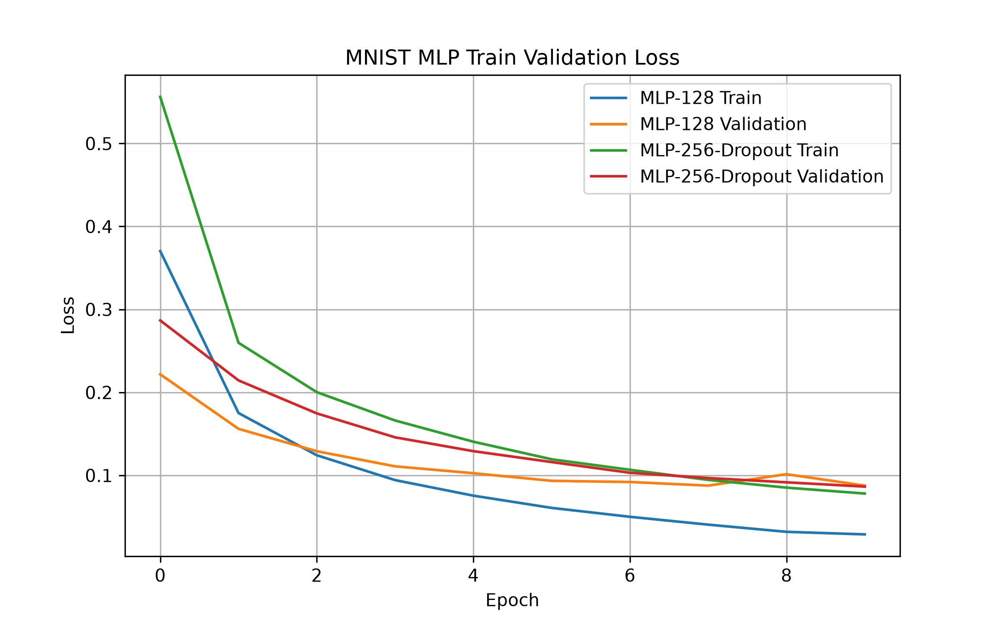

多层感知机、ReLU、过拟合、欠拟合、Dropout、权重衰减、学习率调节

# 多层感知机
定义： 
第一层：
h=W1x+b1 
第二层：
y=W2h+b2 
多个层叠加：
y=Wn(...W2(W1x+b1)+b2...) 
这就是：
**深度神经网络（Deep Neural Network）的基本结构。**

# ReLU激活函数
公式：
f(x)=max(0,x)

实际意义：
如果神经网络每一层都是：
y=Wx+b
那么：
两层：
y=W2(W1x+b1)+b2
展开：
y=W2W1x+W2b1+b2​
仍然是：
y=Wx+b
也就是说：
**无论堆多少层，没有激活函数，100层网络本质还是一层线性模型。**
ReLU允许神经网络自动决定哪些特征应该被激活，同时保持正方向梯度传播，使深层网络可以训练。

# 过拟合（Overfitting）
定义：模型在训练数据上表现很好，但在没有见过的新数据上表现很差。

简单理解：记住了训练集，而不是学会了规律。连同训练集中的噪声一同学习了。
```
Epoch增加
训练Loss:
↓ ↓ ↓ ↓ ↓

测试Loss:
先 ↓ ↓
然后↑ ↑ ↑
```

# 欠拟合（Underfitting）
定义：欠拟合是指模型无法充分学习训练数据中的规律，导致训练集和测试集表现都很差。

核心原因：模型复杂度不足。
案例：使用一个线性模型去尝试拟合为一个曲线训练集

# 过拟合和欠拟合总结：
```
                 模型训练状态对比

        欠拟合             正常              过拟合
---------------------------------------------------------
模型能力   太弱             合适              太强

训练集     表现差           表现好            表现很好

测试集     表现差           表现好            表现差

本质       没学到规律       学到了规律        记住了噪声

问题       模型不足         泛化能力好        泛化能力差

解决       增加模型能力     保持当前状态      限制模型能力
---------------------------------------------------------
```

# Dropout
理解：训练时，随机关闭一部分神经元，让网络不要过度依赖某几个特征，从而提高泛化能力。

核心思想：不要让模型“背答案”，逼迫它学会真正的规律。

```
假设：
一层输出：
h=[1,2,3,4]
Dropout概率：
p=0.5
表示：
50%概率关闭。
随机mask：
例如：
mask=[1,0,1,0]
得到：
h′=[1,0,3,0]
但是有一个问题：
输出平均值变小。
所以训练时会进行缩放：
称为：
**inverted dropout**
实际：
保留神经元：
除以保留概率。
例如：
保留概率：
p=0.5
所以：
[1,0,3,0]
↓
[2,0,6,0]
```

# 权重衰减（Weight Decay）
理解 ：权重衰减是在训练过程中告诉模型：不要为了拟合训练数据，把某些权重调整到非常夸张。
$$
Loss​=Loss+λ∑w^2
$$

因为在拟合中大权重意味着模型对某些特征非常敏感，加入权重衰减后模型发现：
比如：w1权重=100,w2=1,w3=1
虽然预测准确：
但是惩罚=10000 太大。
于是模型倾向于其他更为均衡的权重分配

# 学习率调节（Learning Rate Scheduling）
理解：学习率调节就是让模型在训练初期快速学习，在接近最优解时小步精修。

在先前的实验中我们已经能够初步看到lr的调整对于一个线性回归模型的训练的印象
我们可以得出一个结论
**学习率太大**：
跳过最优点
震荡
甚至无法收敛
**学习率太小**：
训练非常慢
容易卡住

因此就能够很自然的想到一个新的优化策略：训练过程不同阶段使用不同的lr

以下是4种常见的学习率调节方法：
## Step Decay（阶梯下降）
规则：
每隔固定epoch降低一次。
```
scheduler = torch.optim.lr_scheduler.StepLR(
    optimizer,
    step_size=30,                            #30轮
    gamma=0.1                                #lr降低十倍
)
```
```
lr和epoch的关系
epoch 0:
0.1
epoch 30:
0.01
epoch 60:
0.001
```

## Exponential Decay（指数衰减）
规则：
每一步都降低：
$$
lrt=lr0×γ^t
$$
```
epoch:
0:
0.1
10:
0.05
20:
0.025
```
## Cosine Annealing（余弦退火）
规则：
$$lr = lr_{min}+\frac{1}{2}(lr_{max}-lr_{min})
\left(1+\cos\left(\frac{T}{T_{max}}\pi\right)\right)
$$
省流来说，他的学习率变化类似于：
$$
y=cos(x)
$$
## Warmup（预热）
核心思想：训练刚开始时，不直接使用较大的学习率，而是从一个很小的学习率逐渐增加到目标学习率。

## 总结
```
+--------------+------------------+------------------+------------------+
| 策略         | 核心思想         | lr变化           | 作用             |
+--------------+------------------+------------------+------------------+
| Step Decay   | 阶梯下降         | 固定epoch降lr    | 简单稳定         |
+--------------+------------------+------------------+------------------+
| Exponential  | 持续衰减         | lr×γ^t           | 平滑下降         |
| Decay        |                  |                  |                  |
+--------------+------------------+------------------+------------------+
| Cosine       | 余弦下降         | cos曲线变化      | 后期稳定收敛     |
| Annealing    |                  |                  |                  |
+--------------+------------------+------------------+------------------+
| Warmup       | 慢启动           | 小lr→目标lr      | 防止初期震荡     |
+--------------+------------------+------------------+------------------+
```
# 实验记录
MNIST MLP 分类实验中：
- 输入：手写数字图片
- 输出：0~9 十个类别
- 任务：判断图片属于哪个数字
```
import torch
import torch.nn as nn
import torch.optim as optim
from torchvision import datasets, transforms
from torch.utils.data import DataLoader, random_split
import matplotlib.pyplot as plt
from pathlib import Path
import pandas as pd
#上述都是下面需要使用的依赖库
  
  

torch.manual_seed(0)                        #设置随机种子

  

OUTPUT_DIR = Path("./deep_learning/output") #设置输出目录

OUTPUT_DIR.mkdir(                           #如果不存在，创造文件夹
    exist_ok=True
)

transform = transforms.Compose([            #把原始的 MNIST 图片转换成神经网络能够处理的张量格式。
    transforms.ToTensor()
])

  

full_train_dataset = datasets.MNIST(        #加载完整的60000张的训练集
    root="./deep_learning/data",            #训练集保存路径
    train=True,                             #用于训练 
    download=True,                          #如果没有数据自动下载
    transform=transform                     #图片转换
)

  

test_dataset = datasets.MNIST(              #加载测试集
    root="./deep_learning/data",
    train=False,                            #并不用于训练
    download=True,
    transform=transform
)

train_size = 50000                          #用于训练的数量
val_size = 10000                            #用于验证的数量

train_dataset, val_dataset = random_split(  #将官方集随机划分成测试和验证两个数据集
    full_train_dataset,
    [
        train_size,
        val_size
    ]
)

print(                                      #输出训练集数量
    "训练集:",
    len(train_dataset)
)

print(                                      #输出验证集数量
    "验证集:",
    len(val_dataset)
)
 
print(                                      #输出测试集数量
    "测试集:",
    len(test_dataset)
)

class MLP(nn.Module):                       #创建MLP神经网络类并初始化网络
    def __init__(
        self,
        hidden_size=128,                    #隐藏层大小
        dropout=0                           #Dropout概率
    ):

        super().__init__()                  #初始化父类
        self.model = nn.Sequential(         #网络结构
            nn.Flatten(),                   #展平图片1×28×28->784
            nn.Linear(                      #全连接层
                784,                        #输入
                hidden_size                 #输出hidden_size个隐藏特征
            ),
            nn.ReLU(),                      #激活函数
            nn.Dropout(                     #Dropout
                dropout                     
            ),
            nn.Linear(                      #输入隐藏特征输出10个类别
                hidden_size,
                10
            )
        )
 
    def forward(self,x):                    #将输入 x 通过 self 所保存的网络结构 self.model进行前向传递
        return self.model(x)

def evaluate(                               #定义评价函数
        model,                              #mlp
        loader,                             #加载数据集
        loss_function                       #计算loss
):
    model.eval()                            #切换评价模式
    total_loss = 0                          #初始化数据
    correct = 0
    total = 0
    
    with torch.no_grad():                   #关闭梯度计算（因为测试不需要）
        for images,labels in loader:        #从 DataLoader 取一个 batch
            output = model(images)          #前向传播
            loss = loss_function(           #计算loss
                output,
                labels
            )
            total_loss += loss.item()       #累计损失值
            prediction = torch.argmax(      #找最大概率类别
                output,
                dim=1
            )
            correct += (                    #统计正确数量
                prediction == labels
            ).sum().item()

  

            total += labels.size(0)
    avg_loss = (                            #计算平均loss
        total_loss /
        len(loader)
    )
    accuracy = correct / total              #计算准确率
    return avg_loss, accuracy               #返回结果

  

def train_model(                            #创建训练函数
        name,
        hidden_size,
        lr,
        batch_size,
        dropout
):

    print("\n================")             #输出以区分两次实验
    print(name)
    print("================")

    train_loader = DataLoader(              #创建训练批次
        train_dataset,
        batch_size=batch_size,
        shuffle=True                        #每轮打乱数据
    )
    val_loader = DataLoader(                #创建验证批次
        val_dataset,
        batch_size=1000
    )
    test_loader = DataLoader(               #创建测试批次
        test_dataset,
        batch_size=1000
    )

    model = MLP(                            #创建模型
        hidden_size,
        dropout
    )

    loss_function = nn.CrossEntropyLoss()   #定义**分类任务使用的损失函数**

    optimizer = optim.Adam(                 #Adam优化器，根据梯度更新参数
        model.parameters(),
        lr=lr
    )

    epochs = 10                             #训练轮数

    train_loss_history = []                 #记录训练loss

    val_loss_history = []                   #记录验证loss

    for epoch in range(epochs):             #训练循环
        model.train()                       #开启训练模式
        total_loss = 0                      #初始化数据
        for images,labels in train_loader:  #DataLoader 取一个 batch
            output = model(images)          #前向传播
            loss = loss_function(           #计算loss
                output,
                labels
            )
            optimizer.zero_grad()           #清空旧梯度
            loss.backward()                 #反向传播
            optimizer.step()                #更新参数
            total_loss += loss.item()       #累计loss
        train_loss = (                      #计算训练集平均 loss
            total_loss /
            len(train_loader)
        )
        val_loss,val_acc = evaluate(        #使用验证集评价模型
            model,
            val_loader,
            loss_function
        )
        train_loss_history.append(          #保存训练 loss
            train_loss
        )
        val_loss_history.append(            #保存验证 loss
            val_loss
        )
        print(                              #输出结果
            f"Epoch {epoch+1}/{epochs}",
            f"Train Loss={train_loss:.4f}",
            f"Val Loss={val_loss:.4f}",
            f"Val Acc={val_acc:.4f}"
        )
    test_loss,test_acc = evaluate(          #使用测试集评价模型
        model,
        test_loader,
        loss_function
    )
    print(                                  #输出测试集结果 loss
        "Test Accuracy:",
        test_acc
    )
    
    return (                                #把训练结束后的三个重要结果返回
        test_acc,
        train_loss_history,
        val_loss_history
    )
  
acc1,train1,val1 = train_model(                #调用训练函数进行A实验
    name="实验A: MLP-128",
    hidden_size=128,
    lr=0.001,
    batch_size=64,
    dropout=0
)

acc2,train2,val2 = train_model(                #调用训练函数进行B实验
    name="实验B: MLP-256-Dropout",
    hidden_size=256,
    lr=0.0005,
    batch_size=128,
    dropout=0.3
)

plt.figure(                                    #绘制创建画布
    figsize=(8,5)
)
plt.plot(                                      #绘制实验A训练Loss
    train1,
    label="MLP-128 Train"
)
plt.plot(                                      #绘制实验A验证Loss
    val1,
    label="MLP-128 Validation"
)
plt.plot(                                      #绘制实验B训练Loss
    train2,
    label="MLP-256-Dropout Train"
)
plt.plot(                                      #绘制实验B验证Loss
    val2,
    label="MLP-256-Dropout Validation"
)
plt.xlabel(                                    #设置X坐标轴
    "Epoch"
)
plt.ylabel(                                    #设置Y坐标轴
    "Loss"
)
plt.title(                                     #设置标题
    "MNIST MLP Train Validation Loss"
)
plt.legend()                                   #显示图例
plt.grid()                                     #添加网格
plt.savefig(                                   #保存图片
    OUTPUT_DIR /
    "train_validation_loss.png",
    dpi=300
)
plt.show()                                     #显示图片
result_table = pd.DataFrame({                  #生成实验结果的pandas表
    "Experiment":[
        "MLP-128",
        "MLP-256-Dropout"
    ],
    "Hidden_Size":[
        128,
        256
    ],
    "Learning_Rate":[
        0.001,
        0.0005
    ],
    "Batch_Size":[
        64,
        128
    ],
    "Dropout":[
        0,
        0.3
    ],
    "Test_Accuracy":[
        acc1,
        acc2
    ]
})
result_table.to_csv(                            #保存 CSV
    OUTPUT_DIR /
    "accuracy_result.csv",
    index=False
)
print("\n实验结果")
print("----------------")
print(result_table)
```
## 实验结果
### 终端部分


### output部分

