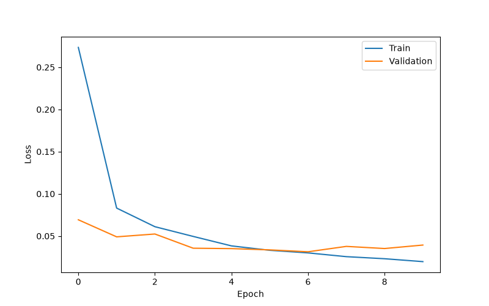
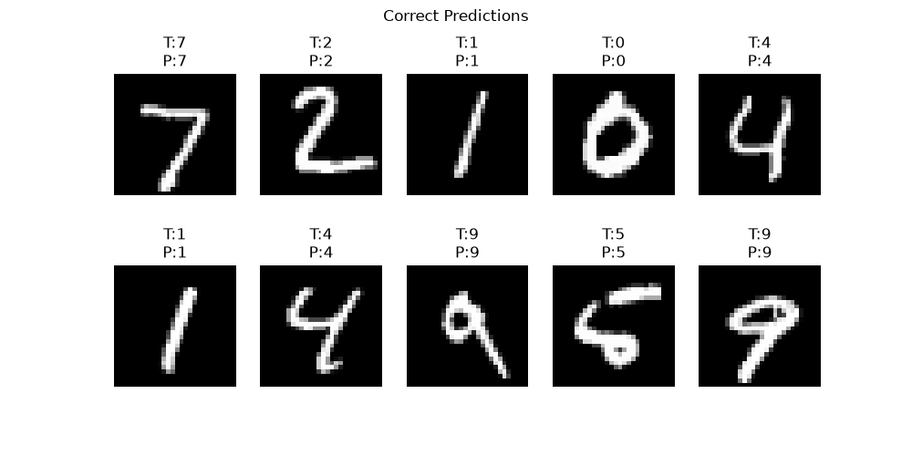
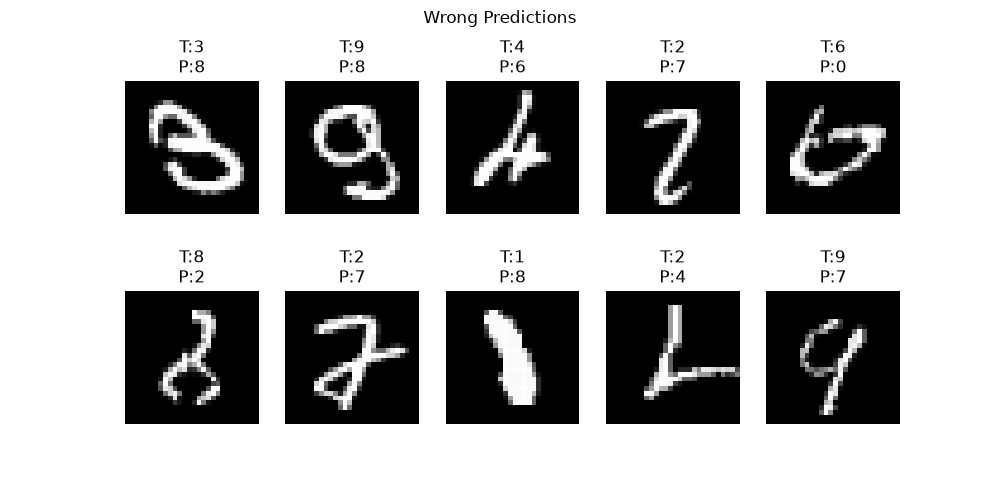

卷积、卷积核、padding、stride、池化、通道、特征图、LeNet、简单 CNN。
# 卷积&卷积核&特征图

理解：用一个小窗口在图片上滑动，对局部区域做计算。
而这个小窗口就是**卷积核**。

## 卷积核覆盖
原图和卷积核的逐元素各自相乘后将原来的核心位置变为一个数字
然后窗口移动，由此获得一个新的矩阵
这个新的矩阵就是**特征图 Feature Map**

# 通道 Channel
定义：图片有多少层信息。
例如灰度图片：28×28×1
那么只有一个通道：亮度
RGB 图片：224×224×3
那么有三个通道：R 红色 G 绿色 B 蓝色

CNN 中通道会因为卷积核数量变化
例如输入一个灰度图片但是使用了16个3 * 3卷积核
28×28×1 -> 26×26×16（一个卷积核产生一个通道）

# Padding（填充）
 理解：由于卷积会缩小图片为了保持尺寸，所以加入 padding。
 常见的有以下方式:
## valid convolution
不填充
padding=0
## same convolution
保持尺寸
padding=1

**注意：这里的01并不代表数字，使用与填充的数字一般默认都是0**
**这里的01的意义在于是否是否填充**

# Stride（步长）
表示： 卷积核每次移动多少格
作用：降低空间尺寸。

拓展：Stride（步长）的长度如果设计不好不能够在图片上整除，深度学习框架通常会选择丢弃边缘无法完整覆盖的部分（floor），或者通过 padding 调整尺寸。
例如：
输入：
5×5 图片
卷积核：
3×3
stride=2
padding=0
输出：2×2

# 池化 Pooling
理解：对特征图进行压缩。

用途：
减少计算量
提高鲁棒性
提取主要特征

常见方式：
## 最大池化 Max Pooling
例如：2×2区域：
1 3
2 8
取最大：8
输入：28×28
MaxPool：2×2
输出：14×14

## 平均池化
取平均：
 (1+3+2+8)/4=3.5

现代 CNN更常使用：
Max Pooling
或者：
直接用 stride 卷积代替。
（即不再使用单独的池化层（Pooling）来缩小特征图，而是在卷积层中直接把 stride 设置大于 1，让卷积操作同时完成“特征提取 + 下采样”。）

# LeNet

结构：
Input (28×28×1)→Conv→Pooling→Conv→Pooling→全连接→分类

案例：经典LeNet-5：
Input (32×32×1)→Conv1 (5×5, 6 channels)→Pool→Conv2 (5×5, 16 channels) →Pool→FC→Output (10 classes)

理解：
第一层：
学习：边缘、简单纹理
第二层：
学习：形状组合
最后：
分类：0~9

# 简单 CNN

理解：卷积是基本操作，CNN 是把这些操作组织成一个完整的神经网络结构。

简单CNN的逻辑：图片像素 → 卷积核扫描 → 产生特征图 → 不断组合特征 → 高级语义 → 分类

区别于LeNet：
ReLU（LeNet 原始使用 sigmoid/tanh）
BatchNorm（常见）
Dropout（防过拟合）
更多卷积层
更大的通道数
区别于MLP：
MLP 学习“每个像素和结果的关系”；CNN 学习“局部结构如何组成目标”。

案例：（MNIST 手写数字）
输入图片 → 卷积层 Conv → ReLU 激活 → 池化 Pooling → 卷积层 Conv → ReLU 激活 → 池化 Pooling → Flatten 展平 → 全连接层 Linear → 分类结果

# 实验结果
```
import torch
import torch.nn as nn
import torch.optim as optim

from torchvision import datasets, transforms
from torch.utils.data import DataLoader, random_split
import matplotlib.pyplot as plt
import pandas as pd
from pathlib import Path

  

torch.manual_seed(0)                             #随机种子

OUTPUT_DIR = Path(                               #存储路径
    "./deep_learning/output"
)

OUTPUT_DIR.mkdir(                                 #检测存储路径是否存在
    exist_ok=True
)

device = torch.device(                            #选择训练设备（如果有CUDA）
    "cuda"
    if torch.cuda.is_available()
    else "cpu"
)

print(                                             #输出使用的训练设备
    "Device:",
    device
)

transform = transforms.Compose(                    #MNIST 原始图片转为张量
    [
        transforms.ToTensor()
    ]
)

full_train_dataset = datasets.MNIST(                #加载完整数据集
    root="./deep_learning/data",
    train=True,
    download=True,
    transform=transform
)

test_dataset = datasets.MNIST(                      #加载测试数据集
    root="./deep_learning/data",
    train=False,
    download=True,
    transform=transform
)

train_dataset,val_dataset = random_split(            #划分验证和训练数据集大小
    full_train_dataset,
    [50000,10000]
)

train_loader = DataLoader(                            #创建训练数据加载器
    train_dataset,
    batch_size=64,
    shuffle=True
)

val_loader = DataLoader(                              #创建验证数据加载器
    val_dataset,
    batch_size=64
)

test_loader = DataLoader(                             #创建测试数据加载器
    test_dataset,
    batch_size=64
)

class CNN(nn.Module):                                  #创建 CNN 网络类
    def __init__(self):                                #初始化网络结构
        super().__init__()                             #初始化父类
        self.conv = nn.Sequential(                     #定义卷积模块
            nn.Conv2d(                                 #第一卷积层
                1,                                     #输入通道
                32,                                    #输出通道
                3,                                     #卷积核
                padding=1                              #补一圈0
            ),
            nn.ReLU(),                                 #激活函数
            nn.MaxPool2d(2),                           #最大池化窗口
            
            nn.Conv2d(                                 #第二卷积层
                32,
                64,
                3,
                padding=1
            ),
            nn.ReLU(),
            nn.MaxPool2d(2)
        )
        
        self.fc = nn.Sequential(                        #定义分类部分
            nn.Flatten(),                               #展平
            nn.Linear(                                  #全连接层
                64*7*7,                                 #输入
                128                                     #输出特征数量
            ),
            nn.ReLU(),
            nn.Dropout(                                 #Dropout
                0.3
            ),
            nn.Linear(                                  #输出层
                128,
                10
            )
        )

  
  

    def forward(self,x):                                #前向传播
        x=self.conv(x)
        x=self.fc(x)
        return x

model=CNN().to(device)                                  #创建 CNN

criterion = nn.CrossEntropyLoss()                       #损失函数

optimizer = optim.Adam(                                 #使用 Adam 更新参数,根据反向传播得到的梯度，调整模型参数
    model.parameters(),
    lr=0.001
)

epochs=10                                               #训练轮数

train_loss_history=[]                                   #记录loss
val_loss_history=[]

  

for epoch in range(epochs):                             #训练循环
    model.train()                                       #训练模式
    total_loss=0                                        #初始化loss

    for images,labels in train_loader:                  #每次取一个batch
        images=images.to(device)                        #数据放入训练设备
        labels=labels.to(device)
        output=model(images)                            #前向传播
        loss=criterion(                                 #计算loss
            output,
            labels
        )
        optimizer.zero_grad()                           #清空梯度
        loss.backward()                                 #反向传播
        optimizer.step()                                #更新权重
        total_loss += loss.item()                       #累计loss
    train_loss = (                                      #计算loss
        total_loss /
        len(train_loader)
    )

    model.eval()                                        #进入测试模式
    val_loss=0
    with torch.no_grad():                               #关闭梯度
        for images,labels in val_loader:
            images=images.to(device)
            labels=labels.to(device)
            output=model(images)
            loss=criterion(
                output,
                labels
            )
            val_loss += loss.item()
    val_loss /= len(val_loader) 
    train_loss_history.append(                           #记录历史loss数据
        train_loss
    )
    val_loss_history.append(
        val_loss
    )
    
    print(                                               #输出loss数据
        f"Epoch {epoch+1}/{epochs} "
        f"Train:{train_loss:.4f} "
        f"Val:{val_loss:.4f}"
    )

plt.figure(                                              #绘制图片并保存
    figsize=(8,5)
)
plt.plot(
    train_loss_history,
    label="Train"
)
plt.plot(
    val_loss_history,
    label="Validation"
)
plt.xlabel(
    "Epoch"
)
plt.ylabel(
    "Loss"
)
plt.legend()
plt.savefig(
    OUTPUT_DIR /
    "cnn_loss.png"
)
plt.close()

  

model.eval()                                             #评价模式
correct=0
total=0
images_all=[]                                            #保存测试图片（为了用于输出案例）
labels_all=[]                                            #保存真实标签
preds_all=[]                                             #保存预测结果
with torch.no_grad():
    for images,labels in test_loader:
        images=images.to(device)
        labels=labels.to(device)
        output=model(images)
        preds=torch.argmax(                               #获取预测类别
            output,
            dim=1
        )
        correct += (                                       #计数正确值
            preds==labels
        ).sum().item()
        total += labels.size(0)                            #计算当前 batch 图片数量
        images_all.extend(                                 #把当前 batch 图片加入列表
            images.cpu()
        )
        labels_all.extend(                                 #保存真实标签
            labels.cpu()
        )
        preds_all.extend(                                  #保存预测标签
            preds.cpu()
        )
accuracy = (                                               #计算准确率
    correct/total*100
)
print(                                                     #输出
    f"Test Accuracy:{accuracy:.2f}%"
)

  
def visualize(                                             #定义一个图片显示函数
    index_list,                                            #需要显示第几张图片
    name,                                                  #保存文件名
    title                                                  #图片标题
):

    plt.figure(
        figsize=(10,5)
    )
    for i,index in enumerate(index_list):                  #2行5列
        plt.subplot(
            2,
            5,
            i+1                                            #位置编号
        )
        plt.imshow(                                        #显示 MNIST 图片
            images_all[index].squeeze(),                   #原图片去掉通道
            cmap="gray"                                    #使用灰度显示
        )
        plt.title(                                         #标题
            f"T:{labels_all[index]}\nP:{preds_all[index]}"
        )
        plt.axis(                                          #不用坐标轴
            "off"
        )

    plt.suptitle(title)                                    #设置总标题
    plt.savefig(
        OUTPUT_DIR/name
    )
    plt.close()

correct_index=[]                                           #找正确预测样例
for i in range(len(labels_all)):
    if labels_all[i]==preds_all[i]:                        #如果预测正确
        correct_index.append(i)                            #保存图片编号
    if len(correct_index)==10:                             #计数
        break
visualize(                                                 #显示正确样例
    correct_index,
    "cnn_prediction_samples.png",
    "Correct Predictions"
)

error_index=[]                                             #找正确预测样例
for i in range(len(labels_all)):
    if labels_all[i]!=preds_all[i]:                        #如果预测错误
        error_index.append(i)
    if len(error_index)==10:
        break

visualize(
    error_index,
    "cnn_error_samples.png",
    "Wrong Predictions"
)

pd.DataFrame(                                              #创建表格展示结果
    {
        "Model":[
            "CNN"
        ],
        "Accuracy":[
            accuracy
        ]
    }
).to_csv(                                                  #保存为CSV
    OUTPUT_DIR/
    "cnn_result.csv",
    index=False
)
```
## 实验结果
### 终端部分

### output部分



