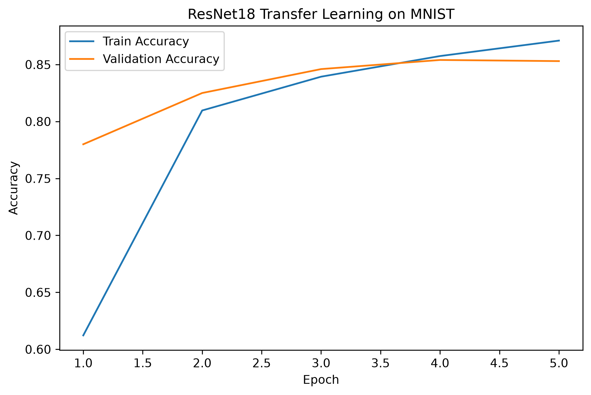

AlexNet、VGG、GoogLeNet、ResNet、BatchNorm、残差连接、预训练模型、微调

#  AlexNet

针对问题：能不能用一个比较深的 CNN，直接从大量图片中自动学习特征，并取得比传统手工特征更好的效果？
## 结构：
输入图像 → 卷积层 → 池化层 → 卷积层 → 池化层 → 卷积层 → 卷积层 → 卷积层 → 池化层 → 全连接层 → 全连接层 → 全连接层 → 输出分类结果
省流：5个卷积层+3个全连接层
## 重要技术
ReLU
Dropout
GPU

## 学习意义
证明“大型深度CNN”在视觉任务上行得通

# VGG

研究问题：如果把 CNN 做得更深，会发生什么？
## 核心思想：
大量使用3 * 3小卷积核
（假设连续两个 3×3 卷积它们组合后的有效感受野大致可以达到：5×5
三个 3×3：7×7
例如通道数均为 C。
一个 5×5 卷积参数量：$25C^2$
两个 3×3：$18C^2$
参数更少。
而且中间还能加入 ReLU：
Conv→ReLU→Conv→ReLU
非线性表达能力更强。）

# GoogLeNet

设计目标：能不能让网络结构设计得更聪明，而不是只靠暴力堆层数？
重点：Inception 模块
## Inception 模块

```
             ┌→ 1×1 Conv ──┐
             │              │
             ├→ 3×3 Conv ──┤
Input ───────┤              ├→ Concatenate
             ├→ 5×5 Conv ──┤
             │              │
             └→ Pooling ────┘
```
Inception 的思想是：我不提前赌哪一个卷积尺度最好，多种尺度都计算，再把结果组合起来。即：多尺度特征提取​
特点：1 * 1卷积核
目的：通道降维，让后面的其他卷积核的计算量大幅下降
## 总结：
GoogLeNet利用 Inception 并行提取多尺度特征，同时用 1×1 卷积控制计算量。
# ResNet（残差网络）
概念创新：
$$
H(x)=F(x)+x
$$
## 重点
通过残差连接让非常深的网络更容易优化。
## 退化问题
例如原来有一个：20层网络。
现在增加层数变成：56层
最坏的情况下，多出来的层学习：
H(x)=x
就行了。
因此理论上 56 层至少不应该比 20 层差。
但实际实验：
**更深网络的训练误差反而可能更高**
而下面的残差连接就能够相对较好的回答这个问题（只做f(x)的加法）
让深层网络具有更容易找到的恒等映射路径，从而缓解深度增加导致的优化困难。
（ResNet 在不保证线性关系的情况下额外的至少保证了一层线性关系以维持不做变动的最差选项）​

# BatchNorm
问题：训练神经网络的时候，中间特征的数值可能不断变化。
## 案例：
比如某一层输出：
-100, 35, 76, 120 ...
另一阶段可能又变成：
-0.3, 0.5, 1.2 ...
过于不稳定的数值尺度可能让优化变困难。
于是 BN 做标准化。
设一个 batch 中某特征为：

$x_1,x_2,\cdots,x_m$
计算均值：

$\mu_B=\frac{1}{m}\sum_{i=1}^{m}x_i$
计算方差：

$\sigma_B^2=\frac{1}{m}\sum_{i=1}^{m}(x_i-\mu_B)^2$
标准化：

$\hat{x}_i= \frac{x_i-\mu_B} {\sqrt{\sigma_B^2+\epsilon}}​​$​

这样特征大致被调整到：

均值≈0 方差≈1
同时，如果永远强制所有特征都是均值 0、方差 1，反而限制网络表达能力，所以BN 再加入两个可学习参数：γ,β（针对每个通道都有各自的γ,β）
让y=γx+β​进行缩放和平移
## 总结：
BatchNorm：对网络中间特征进行标准化和可学习重缩放，使训练更加稳定。​
# 残差连接

## 残差连接和梯度的关系
如果：

y=x+F(x)

那么：
$$ \frac{\partial y}{\partial x} = \frac{\partial (x+F(x))}{\partial x} $$
$$ \frac{\partial y}{\partial x} = 1+\frac{\partial F(x)}{\partial x} $$
注意这个：1
说明了残差连接给梯度提供了一条不经过任何权重层的直接传播路径（即哪怕后面的导数非常小也能够保留一个相对可观的数字）
# 预训练模型

## 预训练的意思
先拿一个大型数据集：A​
训练：$θ_0​→θ^∗$
得到：$f(x;θ^∗)$
这组已经学好的：$θ^∗$
就是：预训练权重​
带着这些权重的模型就是预训练模型。

## 实际目的
利用预训练任务中已经学习到的可迁移知识作为新任务的参数起点​
# 微调

## 实际目的
别人训练好的模型怎么变成进一步进行修改自定义
## 示例：在基底模型的基础上训练，进而产生lora（当然这个只是助于理解的说法，严肃说这里的示例并不严谨）

## 微调的三种程度
### 第一种：只训练分类器
CNN Backbone     冻结
CNN Backbone     冻结
CNN Backbone     冻结
Classifier       训练
### 第二种：解冻后面的层
前半部分       冻结
后半部分       训练
分类头         训练
### 第三种：全部微调
整个网络：
$θ_1​,θ_2​,…,θ_n​$
都继续更新。
这是：
full fine-tuning​
特点：一般学习率会比较小。（因为原来的参数已经是不错的解，一般不做太大程度的调整）

## 适合的应用场景
自己的数据不够多
但是却想要训练一个很复杂的模型

## 总结：
微调：以预训练权重为起点，用目标任务的数据继续更新模型参数。​

# 经典网络对比表

|模型/技术|类型|研究问题|核心思想|结构特点|解决的问题|学习意义|
|---|---|---|---|---|---|---|
|**MLP**|全连接神经网络|如何利用神经网络学习复杂非线性函数？|多层神经元通过反向传播自动学习参数|输入层 → 多个全连接层 → 输出层|可以学习复杂映射关系|深度学习基础，但不适合图像任务|
|**CNN**|卷积神经网络|如何让网络理解图像中的空间结构？|局部感受野 + 权值共享 + 卷积提取特征|卷积层 → 激活函数 → 池化层 → 全连接层|降低参数量，提取局部视觉特征|奠定现代计算机视觉基础|
|**AlexNet**|深层CNN|能否利用深层CNN自动学习图像特征，并超过人工设计特征？|大规模深度卷积网络训练|5个卷积层 + 3个全连接层|证明深层CNN具有强大的视觉特征学习能力|开启深度学习视觉时代|
|**VGG**|深层CNN|CNN是否可以通过增加深度获得更强能力？|使用大量小卷积核堆叠网络深度|多个3×3卷积连续堆叠|提升网络表达能力，同时保持结构简单|证明网络深度的重要性|
|**GoogLeNet**|高效CNN结构|能否设计比单纯加深更高效的网络？|Inception模块，多尺度特征融合|多分支结构：1×1、3×3、5×5卷积并行，再Concat|同时提取不同尺度特征，减少计算量|引入网络结构设计思想|
|**ResNet**|深层CNN|为什么网络越深反而可能性能下降？|残差学习，通过Shortcut保留信息路径|H(x)=F(x)+x|缓解深层网络退化问题，使超深网络可训练|解决深度CNN优化困难|
|**BatchNorm**|网络训练技术|为什么深层网络训练不稳定？|对中间特征进行标准化，并学习缩放和平移|Normalize → γ缩放 → β偏移|稳定训练，加速收敛|使训练更深网络成为可能|
# 小数据集分类实验

用 torchvision 预训练 ResNet 做一个MNIST小数据集分类实验。

```
import torch
import torch.nn as nn
import torch.optim as optim
from torchvision import datasets, transforms, models
from torchvision.models import ResNet18_Weights
from torch.utils.data import DataLoader, random_split
from pathlib import Path
import pandas as pd
import matplotlib.pyplot as plt 
#依赖库

  

torch.manual_seed(0)


device = torch.device(
    "cuda" if torch.cuda.is_available()
    else "cpu"
)
print("Device:", device)

OUTPUT_DIR = Path(
    "./deep_learning/output"
)
OUTPUT_DIR.mkdir(
    exist_ok=True
)

transform = transforms.Compose([
    transforms.Resize(                             # 图片尺寸调整（本来预计是224*224的不过为了减少运行时间这里使用64）
        (64,64)
    ),
    
    transforms.Grayscale(                          # 单通道转三通道，因为ResNet需要
        num_output_channels=3
    ),
    
    transforms.ToTensor(),                         # 转Tensor

    transforms.Normalize(                          # ImageNet预训练模型的标准化
        mean=[
            0.485,
            0.456,
            0.406
        ],
        std=[
            0.229,
            0.224,
            0.225
        ]
    )
])

full_train_dataset = datasets.MNIST(
    root="./deep_learning/data",
    train=True,
    download=True,
    transform=transform
)

small_train_dataset, _ = random_split(              #为了减少运行时间，这里只取10000张训练数据
    full_train_dataset,
    [
        10000,                                      #取10000张
        len(full_train_dataset)-10000               #10000张以外的值付给_
    ],
    generator=torch.Generator()                     #随机数生成器
    .manual_seed(0)                                 #种子
)

test_dataset = datasets.MNIST(
    root="./deep_learning/data",
    train=False,
    download=True,
    transform=transform
)


train_size = int(                                    #训练集长度
    0.9 * len(small_train_dataset)
)

val_size = (                                         #训练集长度
    len(small_train_dataset)
    -
    train_size
)

train_dataset, val_dataset = random_split(           #实际划分链两个数据集 
    small_train_dataset,
    [
        train_size,
        val_size
    ],
    generator=torch.Generator()
    .manual_seed(0)
)

train_loader = DataLoader(
    train_dataset,
    batch_size=128,                                   #为了减少实验耗费时间这里也酌情扩大了
    shuffle=True
)

val_loader = DataLoader(
    val_dataset,
    batch_size=128,
    shuffle=False
)

test_loader = DataLoader(
    test_dataset,
    batch_size=128,
    shuffle=False
)

print(                                                 #输出各个数据集的大小
    "Train:",
    len(train_dataset)
)

print(
    "Validation:",
    len(val_dataset)
)

print(
    "Test:",
    len(test_dataset)
)

model = models.resnet18(                                #加载预训练ResNet18模型（使用默认权重）
    weights=ResNet18_Weights.DEFAULT
)

for param in model.parameters():                        #冻结特征提取层（因为我们这里是使用已训练好的）
    param.requires_grad = False

num_features = model.fc.in_features                     #把 ResNet18 原本用于 ImageNet 1000 分类的最后一层，替换成适合当前任务的分类层（这里是手写数字（0~9））。
model.fc = nn.Linear(
    num_features,
    10
)
model = model.to(device)

criterion = nn.CrossEntropyLoss()                       #损失函数

optimizer = optim.Adam(                                 #优化器指更新fc层（上面那个）的参数，以全面适用于1000分类→10分类
    model.fc.parameters(),
    lr=0.001
)

def train_one_epoch():                                  #训练函数
    model.train()
    total_loss = 0
    correct = 0
    total = 0
    for images, labels in train_loader:
        images = images.to(device)
        labels = labels.to(device)
        optimizer.zero_grad()
        outputs = model(images)
        loss = criterion(
            outputs,
            labels
        )
        loss.backward()
        optimizer.step()
        total_loss += (
            loss.item()
            *
            images.size(0)
        )

        _, predicted = torch.max(
            outputs,
            1
        )
        total += labels.size(0)
        correct += (
            predicted == labels
        ).sum().item()
    return (     
        total_loss / total,
        correct / total
    )

def evaluate(loader):                                    #验证函数
    model.eval()
    total_loss = 0
    correct = 0
    total = 0
    with torch.no_grad():
        for images, labels in loader:
            images = images.to(device)
            labels = labels.to(device)
            outputs = model(images)
            loss = criterion(
                outputs,
                labels
            )

            total_loss += (
                loss.item()
                *
                images.size(0)
            )
            _, predicted = torch.max(
                outputs,
                1
            )
            total += labels.size(0)
            correct += (
                predicted == labels
            ).sum().item()
    return (
        total_loss / total,
        correct / total
    )

epochs = 5                                               #训练轮数这里为了加快实验所以给的数字较小

history = {                                              #记录轮次与相关数据并输出
    "epoch":[],
    "train_loss":[],
    "train_acc":[],
    "val_loss":[],
    "val_acc":[]
}
for epoch in range(epochs):
    train_loss, train_acc = train_one_epoch()
    val_loss, val_acc = evaluate(
        val_loader
    )
    history["epoch"].append(
        epoch+1
    )
    history["train_loss"].append(
        train_loss
    )
    history["train_acc"].append(
        train_acc
    )
    history["val_loss"].append(
        val_loss
    )
    history["val_acc"].append(
        val_acc
    )

    print(
        f"Epoch [{epoch+1}/{epochs}] "
        f"Train Loss:{train_loss:.4f} "
        f"Train Acc:{train_acc*100:.2f}% "
        f"Val Acc:{val_acc*100:.2f}%"
    )

test_loss, test_acc = evaluate(                            #测试集结果与输出
    test_loader
)
print("\nFinal Test Accuracy:")
print(
    f"{test_acc*100:.2f}%"
)

torch.save(                                                #保存模型
    model.state_dict(),
    OUTPUT_DIR /
    "resnet18_mnist_transfer.pth"
)

df = pd.DataFrame(                                         #保存训练记录为csv
    history
)
df.to_csv(
    OUTPUT_DIR /
    "resnet18_transfer_history.csv",
    index=False
)


plt.figure(                                                #绘制准确率曲线并保存
    figsize=(8,5)
)

plt.plot(
    history["epoch"],
    history["train_acc"],
    label="Train Accuracy"
)
plt.plot(
    history["epoch"],
    history["val_acc"],
    label="Validation Accuracy"
)
plt.xlabel(
    "Epoch"
)
plt.ylabel(
    "Accuracy"
)
plt.title(
    "ResNet18 Transfer Learning on MNIST"
)
plt.legend()
plt.savefig(                                              
    OUTPUT_DIR /
    "resnet18_accuracy_curve.png",
    dpi=300,
    bbox_inches="tight"
)
plt.close()
```
## 终端输出部分

## output输出部分
CSV:

准确率曲线图：

模型文件：
