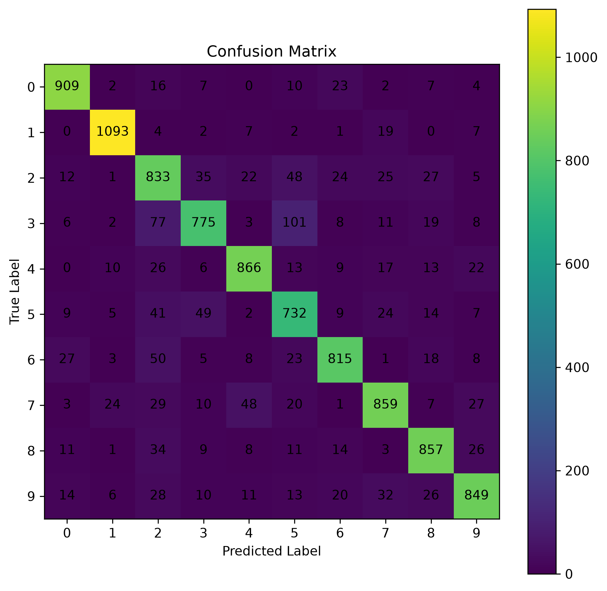
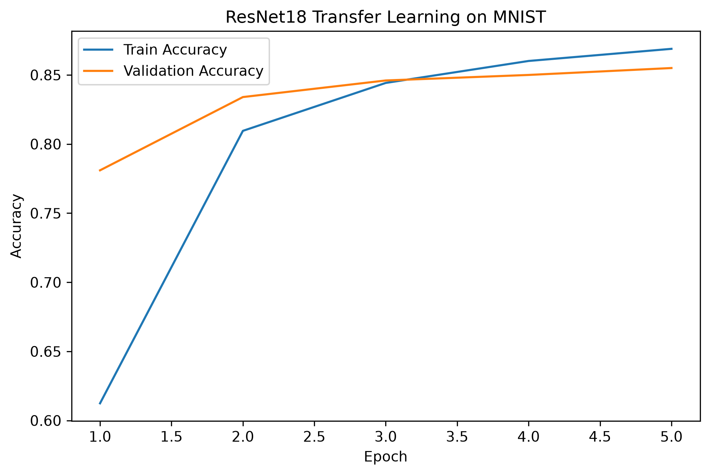

Dataset/DataLoader、数据增强、配置文件、checkpoint、日志、TensorBoard、混淆矩阵

# Dataset / DataLoader

## Dataset：负责“数据是什么”
Dataset
├── 第 1 张图片 → 标签 7
├── 第 2 张图片 → 标签 3
├── 第 3 张图片 → 标签 9
└── ...
一般代码是下面这样
```
from torchvision import datasets

train_dataset = datasets.MNIST(
    root="./data",
    train=True,
    download=True
)
```
## DataLoader：负责“怎么把数据喂给模型”
以MNIST举例有 60000 张图片。
60000 张图片
     ↓
Batch 1：64 张
Batch 2：64 张
Batch 3：64 张
...
代码一般是以下这样：
```
from torch.utils.data import DataLoader

train_loader = DataLoader(
    train_dataset,
    batch_size=64,
    shuffle=True
)
```
所以训练代码是：
```
for images, labels in train_loader:
    outputs = model(images)
```

# 数据增强
针对的问题是：训练数据太少，模型容易过拟合的问题
常见方法：
- RandomCrop：随机裁剪
- RandomHorizontalFlip：随机水平翻转
- RandomRotation：随机旋转
- ColorJitter：改变亮度、对比度、颜色
- RandomResizedCrop：随机缩放 + 裁剪
## 本质
所以数据增强本质上是在提高模型的**泛化能力**。

# 配置文件
针对的问题是：训练实验中的参数，不想全部硬编码在代码。
案例：
假如第一次的：batch_size = 64 learning_rate = 0.001
第二次的想改成：batch_size = 128 learning_rate = 0.00001
可以让python读取配置文件config1l和config2
在两个文件中具体编写配置

## 本质
把“实验参数”和“代码逻辑”分离。

# Checkpoint

## 本质
训练过程中的“存档点”。

## 目的
### 防止训练中断
### 保存最佳模型
比如：
Epoch 10 → val_acc = 90%
Epoch 20 → val_acc = 93%
Epoch 30 → val_acc = 91%
这时候就可以考虑保存Epoch 20

# 日志
## 目的
记录训练的时候具体发生了什么（也包括训练失败的时候发生了什么）

# TensorBoard
## 效果
把训练日志变成可视化实验面板。
即：**实验可视化工具**。
直接在图表中观察：

- train loss
- validation loss
- train accuracy
- validation accuracy
- learning rate
- 模型参数变化
- 图片
- embedding

# 混淆矩阵
##  案例

| Actual \ Pred |   猫 |   狗 |   鸟 |
| ------------- | --: | --: | --: |
| 猫             |  90 |   8 |   2 |
| 狗             |   5 |  92 |   3 |
| 鸟             |   4 |   6 |  90 |
## 意义
对角线 90 92 90 
表示预测正确的几率
非对角线 8、2、5、3、4、6
就展示了具体错成了哪个类别

# 实验部分
## 代码
dataset.py
```
import torch
from torchvision import datasets, transforms
from torch.utils.data import DataLoader, random_split

DATA_DIR = "./deep_learning/data"

BATCH_SIZE = 128
TRAIN_SAMPLES = 10000
VAL_RATIO = 0.1                                        #验证集占比

SEED = 0


def get_transform():
    return transforms.Compose([
        transforms.Resize((64, 64)),
        transforms.Grayscale(
            num_output_channels=3
        ),
        transforms.ToTensor(),
        transforms.Normalize(
            mean=[
                0.485,
                0.456,
                0.406
            ],
            std=[
                0.229,
                0.224,
                0.225
            ]
        )
    ])

def get_datasets():
    transform = get_transform()
    full_train_dataset = datasets.MNIST(
        root=DATA_DIR,
        train=True,
        download=True,
        transform=transform
    )
    small_train_dataset, _ = random_split(
        full_train_dataset,
        [
            TRAIN_SAMPLES,
            len(full_train_dataset) - TRAIN_SAMPLES
        ],
        generator=torch.Generator().manual_seed(SEED)
    )
    train_size = int(
        (1 - VAL_RATIO) * len(small_train_dataset)
    )
    val_size = (
        len(small_train_dataset)
        - train_size
    )
    train_dataset, val_dataset = random_split(
        small_train_dataset,
        [
            train_size,
            val_size
        ],
        generator=torch.Generator().manual_seed(SEED)
    )
    test_dataset = datasets.MNIST(
        root=DATA_DIR,
        train=False,
        download=True,
        transform=transform
    )
    return (
        train_dataset,
        val_dataset,
        test_dataset
    )

def get_dataloaders():
    train_dataset, val_dataset, test_dataset = \
        get_datasets()
    generator = torch.Generator()
    generator.manual_seed(SEED)
    train_loader = DataLoader(
        train_dataset,
        batch_size=BATCH_SIZE,
        shuffle=True,
        generator=generator
    )
    val_loader = DataLoader(
        val_dataset,
        batch_size=BATCH_SIZE,
        shuffle=False
    )
    test_loader = DataLoader(
        test_dataset,
        batch_size=BATCH_SIZE,
        shuffle=False
    )
    return (
        train_loader,
        val_loader,
        test_loader
    )
```
model.py：
```
import torch
import torch.nn as nn
from torchvision import models
from torchvision.models import ResNet18_Weights

def get_model(num_classes=10):                    #定义函数，创建并返回模型
                                                 #num_classes=10表示默认有10 个类别
    model = models.resnet18(
        weights=ResNet18_Weights.DEFAULT
    )
    for param in model.parameters():
        param.requires_grad = False
    num_features = model.fc.in_features
    model.fc = nn.Linear(
        num_features,
        num_classes
    )
    return model
```
train.py:
```
import random
import logging
import numpy as np
import torch
import torch.nn as nn
import torch.optim as optim
import pandas as pd
import matplotlib.pyplot as plt
from pathlib import Path

from dataset import get_dataloaders                       #引用另外两个文件
from model import get_model

SEED = 0
EPOCHS = 5
LEARNING_RATE = 0.001

OUTPUT_DIR = Path(
    "./deep_learning/output"
)
OUTPUT_DIR.mkdir(
    exist_ok=True
)
def set_seed(seed):
    random.seed(seed)
    np.random.seed(seed)
    torch.manual_seed(seed)
    if torch.cuda.is_available():
        torch.cuda.manual_seed(seed)
        torch.cuda.manual_seed_all(seed)
    torch.backends.cudnn.deterministic = True
    torch.backends.cudnn.benchmark = False

def setup_logger():                                #建立日志系统
    logger = logging.getLogger(                    #建立名为training日志记录器
        "training"    
    )
    logger.setLevel(                       
        logging.INFO                               #记录INFO级别及以上的日志
    )
    logger.handlers.clear()                        #清除已有Handler防止重复输出
    formatter = logging.Formatter(
        "%(asctime)s - %(levelname)s - %(message)s" #时间+级别+消息记录（格式）
    )
    file_handler = logging.FileHandler(            #保存到文件
        OUTPUT_DIR / "training.log",
        mode="w",
        encoding="utf-8"
    )
    console_handler = logging.StreamHandler()      #同时输出到终端
    file_handler.setFormatter(                     #把日志写入日志文件的 Handler
        formatter                                  #使用上面的格式
    )
    console_handler.setFormatter(                  #给终端的 Handler 设置格式
    logging.Formatter("%(levelname)s - %(message)s") #级别+消息记录（格式）
)
    logger.addHandler(                             #把文件 Handler 加到 Logger
        file_handler
    )
    logger.addHandler(                             #把控制台 Handler 加到 Logger
        console_handler
    )
    return logger                                  #把前面配置好的logger对象返回给调用这个函数的代码

def train_one_epoch(
    model,
    loader,
    criterion,
    optimizer,
    device
):

    model.train()

    total_loss = 0
    correct = 0
    total = 0

    for images, labels in loader:
        images = images.to(device)
        labels = labels.to(device)
        optimizer.zero_grad()
        outputs = model(images)
        loss = criterion(
            outputs,
            labels
        )
        loss.backward()
        optimizer.step()
        total_loss += (
            loss.item()
            * images.size(0)
        )
        predicted = outputs.argmax(
            dim=1
        )
        total += labels.size(0)
        correct += (
            predicted == labels
        ).sum().item()
    loss = total_loss / total
    accuracy = correct / total
    return loss, accuracy

def evaluate(
    model,
    loader,
    criterion,
    device
):
    model.eval()
    total_loss = 0
    correct = 0
    total = 0
    with torch.no_grad():
        for images, labels in loader:
            images = images.to(device)
            labels = labels.to(device)
            outputs = model(images)
            loss = criterion(
                outputs,
                labels
            )
            total_loss += (
                loss.item()
                * images.size(0)
            )
            predicted = outputs.argmax(
                dim=1
            )
            total += labels.size(0)
            correct += (
                predicted == labels
            ).sum().item()
    loss = total_loss / total
    accuracy = correct / total
    return loss, accuracy

def plot_history(history):
    plt.figure(
        figsize=(8, 5)
    )
    plt.plot(
        history["epoch"],
        history["train_acc"],
        label="Train Accuracy"
    )
    plt.plot(
        history["epoch"],
        history["val_acc"],
        label="Validation Accuracy"
    )
    plt.xlabel(
        "Epoch"
    )
    plt.ylabel(
        "Accuracy"
    )
    plt.title(
        "ResNet18 Transfer Learning on MNIST"
    )
    plt.legend()
    plt.savefig(
        OUTPUT_DIR / "accuracy_curve.png",
        dpi=300,
        bbox_inches="tight"
    )
    plt.close()

def main():
    set_seed(SEED)
    logger = setup_logger()
    device = torch.device(
        "cuda"
        if torch.cuda.is_available()
        else "cpu"
    )
    logger.info(
        f"Device: {device}"
    )
    logger.info(
        f"Seed: {SEED}"
    )
    logger.info(
        f"Epochs: {EPOCHS}"
    )
    logger.info(
        f"Learning Rate: {LEARNING_RATE}"
    )
    train_loader, val_loader, test_loader = \
        get_dataloaders()
    logger.info(
        f"Train samples: {len(train_loader.dataset)}"
    )
    logger.info(
        f"Validation samples: {len(val_loader.dataset)}"
    )
    logger.info(
        f"Test samples: {len(test_loader.dataset)}"
    )
    model = get_model(
        num_classes=10
    )
    model = model.to(device)
    criterion = nn.CrossEntropyLoss()
    optimizer = optim.Adam(
        model.fc.parameters(),
        lr=LEARNING_RATE
    )
    best_val_acc = 0.0
    history = {
        "epoch": [],
        "train_loss": [],
        "train_acc": [],
        "val_loss": [],
        "val_acc": []
    }
    for epoch in range(EPOCHS):
        train_loss, train_acc = \
            train_one_epoch(
                model,
                train_loader,
                criterion,
                optimizer,
                device
            )
        val_loss, val_acc = \ 
            evaluate(
                model,
                val_loader,
                criterion,
                device
            )
        history["epoch"].append(
            epoch + 1
        )
        history["train_loss"].append(
            train_loss
        )
        history["train_acc"].append(
            train_acc
        )
        history["val_loss"].append(
            val_loss
        )
        history["val_acc"].append(
            val_acc
        )
        logger.info(
            f"Epoch [{epoch + 1}/{EPOCHS}] "
            f"Train Loss: {train_loss:.4f} "
            f"Train Acc: {train_acc * 100:.2f}% "
            f"Val Loss: {val_loss:.4f} "
            f"Val Acc: {val_acc * 100:.2f}%"
        )
        if val_acc > best_val_acc:                     #保存最佳模型
            best_val_acc = val_acc
            torch.save(
                model.state_dict(),
                OUTPUT_DIR / "best_model.pth"
            )
            logger.info(
                f"Best model saved. "
                f"Val Acc: {val_acc * 100:.2f}%"
            )
    df = pd.DataFrame(                                 #保存训练历史和绘图
        history
    )
    df.to_csv(
        OUTPUT_DIR / "history.csv",
        index=False
    )
    plot_history(
        history
    )
    logger.info(
        "Training finished."
    )
    logger.info(
        f"Best Validation Accuracy: "
        f"{best_val_acc * 100:.2f}%"
    )

if __name__ == "__main__":                              #执行main()
    main()
```
test.py:
```
import torch
import matplotlib.pyplot as plt
from pathlib import Path

from dataset import get_dataloaders
from model import get_model

OUTPUT_DIR = Path(
    "./deep_learning/output"
)
MODEL_PATH = (
    OUTPUT_DIR / "best_model.pth"
)

DEVICE = torch.device(
    "cuda"
    if torch.cuda.is_available()
    else "cpu"
)

def test_model(
    model,
    loader,
    device
):
    model.eval()
    correct = 0
    total = 0 
    confusion_matrix = torch.zeros(                   #混淆矩阵
        10,
        10,
        dtype=torch.int64                             #矩阵中只存放整数
    )
    with torch.no_grad():
        for images, labels in loader:
            images = images.to(device)
            labels = labels.to(device)
            outputs = model(images)
            predicted = outputs.argmax(
                dim=1
            )
            total += labels.size(0)
            correct += (
                predicted == labels
            ).sum().item()
            for true, pred in zip(                   #统计混淆矩阵
                labels.cpu(),
                predicted.cpu()
            ):
                confusion_matrix[                    
                    true,
                    pred
                ] += 1
    accuracy = correct / total
    return accuracy, confusion_matrix

def plot_confusion_matrix(
    matrix
):
    plt.figure(
        figsize=(8, 8)
    )
    plt.imshow(                                      #把matrix转成 NumPy 数组，然后显示出来，同时plt.imshow()`会把这个二维数字矩阵转换成带有颜色的热力图
        matrix.numpy()
    )
    plt.colorbar()
    plt.xlabel(
        "Predicted Label"
    )
    plt.ylabel(
        "True Label"
    )
    plt.title(
        "Confusion Matrix"
    )
    plt.xticks(
        range(10)
    )
    plt.yticks(
        range(10)
    )
    for i in range(10):                              #把具体数字写到格子里
        for j in range(10):
            plt.text(
                j,
                i,
                str(matrix[i, j].item()),
                ha="center",
                va="center"
            )
    plt.savefig(
        OUTPUT_DIR / "confusion_matrix.png",
        dpi=300,
        bbox_inches="tight"
    )
    plt.close()

def main():
    train_loader, val_loader, test_loader = \
        get_dataloaders()
    model = get_model(
        num_classes=10
    )
    model.load_state_dict(
        torch.load(
            MODEL_PATH,
            map_location=DEVICE
        )
    )
    model = model.to(DEVICE)
    test_acc, matrix = test_model(
        model,
        test_loader,
        DEVICE
    )
    print(
        f"Test Accuracy: {test_acc * 100:.2f}%"
    )
    print(
        "\nConfusion Matrix:"
    )
    print(
        matrix.numpy()
    )
    plot_confusion_matrix(                            #调用函数把混淆矩阵画成热力图
        matrix
    )

if __name__ == "__main__":
    main()
```
## 输出部分
终端输出：
train.py:


test.py:


output部分：



training：


history.csv：


# 可复现实验说明
本实验使用 **PyTorch + torchvision** 完成基于 ResNet18 迁移学习的 MNIST 手写数字分类。
## 1. 实验配置
- 数据集：MNIST
- 训练样本：9000
- 验证样本：1000
- 测试样本：10000
- 模型：ImageNet 预训练 ResNet18
- Batch Size：128
- Epochs：5
- Learning Rate：0.001
- 优化器：Adam
- 损失函数：CrossEntropyLoss
- 随机种子：0
## 2. 数据处理
MNIST 原始图像经过以下处理：
```
28×28 灰度图
    ↓
Resize 到 64×64
    ↓
转换为 3 通道
    ↓
ToTensor
    ↓
Normalize
    ↓
输入 ResNet18
```
训练数据首先固定随机抽取 10000 张，再按照 **9:1** 划分为训练集和验证集。
## 3. 模型训练
使用 ImageNet 预训练的 ResNet18，并冻结原有网络参数，只训练最后替换的全连接层。
每个 Epoch 完成后使用验证集计算 Validation Accuracy，并保存验证准确率最高的模型：
```
best_model.pth
```
## 4. 可复现设置
实验固定随机种子：
```
SEED = 0
```
同时固定 Python、NumPy、PyTorch 和 CUDA 的随机状态，并设置：
```
torch.backends.cudnn.deterministic = True
torch.backends.cudnn.benchmark = False
```
从而保证数据划分和训练过程具有较好的可重复性。

## 5. 实验输出

训练完成后生成：
```
output/
├── best_model.pth
├── training.log
├── history.csv
└── accuracy_curve.png
```
运行 `test.py` 后进一步生成：
```
confusion_matrix.png
```
并输出最终 **Test Accuracy** 和 **10×10 混淆矩阵**。
## 6. 运行方法
```
python train.py
python test.py
```
其中 `train.py` 负责训练、验证和保存最佳模型，`test.py` 负责加载最佳模型并进行最终测试。