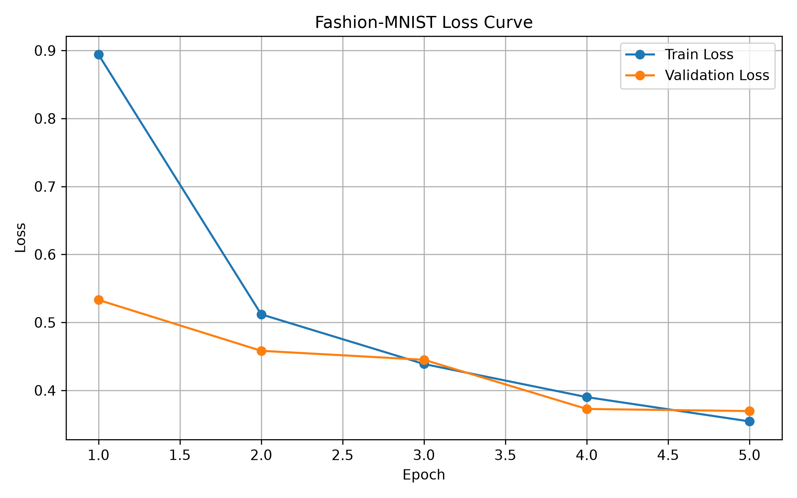

# CV_project部分
## baseline 训练脚本
## Fashion-MNIST CNN Baseline
#### 1. 项目说明
使用 PyTorch 搭建基础 CNN，对 Fashion-MNIST 进行十分类，作为后续实验的 baseline。
#### 2. 数据集
- Train：5000
- Validation：1000
- Test：10000
- 输入：`1 × 28 × 28`
- 类别：10
预处理：
```
transforms.ToTensor()
transforms.Normalize((0.5,), (0.5,))
```
#### 3. 模型结构
```
Input
 ↓
Conv2d(1 → 32) + ReLU + MaxPool
 ↓
Conv2d(32 → 64) + ReLU + MaxPool
 ↓
Flatten
 ↓
Linear(3136 → 128) + ReLU
 ↓
Linear(128 → 10)
```
#### 4. 训练配置
- Optimizer：Adam
- Loss：CrossEntropyLoss
- Batch Size：64
- Learning Rate：0.001
- Epochs：5
训练过程中使用 Validation Accuracy 选择并保存最佳模型。
#### 5. 输出结果
```
outputs/
├── best_model.pth
├── loss_curve.png
├── accuracy_curve.png
└── confusion_matrix.png
```
- `best_model.pth`：验证集表现最佳的模型
- `loss_curve.png`：训练/验证 Loss
- `accuracy_curve.png`：训练/验证 Accuracy
- `confusion_matrix.png`：测试集混淆矩阵
#### 6. 运行
```
python train.py
python test.py
```
## dataset.py
```
import torch

from torchvision import datasets, transforms
from torch.utils.data import DataLoader, random_split


# =========================
# Config引用
# =========================

from configs.config import (
    DATA_DIR,
    BATCH_SIZE,
    SEED,
    TRAIN_SIZE,
    VAL_SIZE
)


# =========================
# 分类名称
# =========================

class_names = [
    "T-shirt/top",
    "Trouser",
    "Pullover",
    "Dress",
    "Coat",
    "Sandal",
    "Shirt",
    "Sneaker",
    "Bag",
    "Ankle boot"
]


# =========================
# 数据预处理，先转张量然后缩放最后标准化
# =========================

transform = transforms.Compose(
    [
        transforms.ToTensor(),

        transforms.Normalize(
            (0.5,),
            (0.5,)
        )
    ]
)


# =========================
# 下载数据集而且划分数据集
# =========================

def get_datasets():

    # 固定随机种子
    generator = torch.Generator()

    generator.manual_seed(SEED)


    # 原始训练集
    full_train_dataset = datasets.FashionMNIST(
        root=DATA_DIR,
        train=True,
        download=True,
        transform=transform
    )


    # 测试集
    test_dataset = datasets.FashionMNIST(
        root=DATA_DIR,
        train=False,
        download=True,
        transform=transform
    )


    # Train / Validation split

    train_dataset, val_dataset, _ = random_split(
    full_train_dataset,
    [
        TRAIN_SIZE,
        VAL_SIZE,
        len(full_train_dataset) - TRAIN_SIZE - VAL_SIZE
    ],
    generator=generator
)


    return (
        train_dataset,
        val_dataset,
        test_dataset
    )


# =========================
# DataLoader 构建
# =========================

def get_dataloaders():

    train_dataset, val_dataset, test_dataset = get_datasets()


    train_loader = DataLoader(
        train_dataset,
        batch_size=BATCH_SIZE,
        shuffle=True
    )


    val_loader = DataLoader(
        val_dataset,
        batch_size=BATCH_SIZE,
        shuffle=False
    )


    test_loader = DataLoader(
        test_dataset,
        batch_size=BATCH_SIZE,
        shuffle=False
    )


    return (
        train_loader,
        val_loader,
        test_loader
    )


# =========================
# dataset的测试（自检与参数展示）
# =========================

if __name__ == "__main__":                                         #只有单独运行这部分时才执行


    train_loader, val_loader, test_loader = get_dataloaders()


    print(
        "Train:",
        len(train_loader.dataset)
    )


    print(
        "Validation:",
        len(val_loader.dataset)
    )


    print(
        "Test:",
        len(test_loader.dataset)
    )


    images, labels = next(
        iter(train_loader)
    )


    print(
        "Image shape:",
        images.shape
    )


    print(
        "Label shape:",
        labels.shape
    )


    print(
        "Image range:",
        images.min().item(),
        images.max().item()
    )


    print(
        "Example label:",
        labels[0].item()
    )


    print(
        "Class:",
        class_names[
            labels[0].item()
        ]
    )
```
### 终端输出


## model.py
```
import torch
import torch.nn as nn


class FashionCNN(nn.Module):

    def __init__(self, num_classes=10):
        super().__init__()

        self.features = nn.Sequential(

            # [1, 28, 28]
            nn.Conv2d(
                in_channels=1,
                out_channels=32,
                kernel_size=3,
                padding=1                                                  #维持尺寸不变
            ),

            # [32, 28, 28]
            nn.ReLU(),

            # [32, 14, 14]
            nn.MaxPool2d(
                kernel_size=2
            ),


            # [32, 14, 14]
            nn.Conv2d(
                in_channels=32,
                out_channels=64,
                kernel_size=3,
                padding=1
            ),

            # [64, 14, 14]
            nn.ReLU(),

            # [64, 7, 7]
            nn.MaxPool2d(
                kernel_size=2
            )
        )


        self.classifier = nn.Sequential(

            # [64, 7, 7]
            # -> [3136]
            nn.Flatten(),

            nn.Linear(
                64 * 7 * 7,
                128
            ),

            nn.ReLU(),

            nn.Linear(
                128,
                num_classes
            )
        )


    def forward(self, x):

        x = self.features(x)

        x = self.classifier(x)

        return x


if __name__ == "__main__":                                           #自检和展示

    model = FashionCNN()

    print(model)                                                     #打印网络结构


    # 模拟一个 batch
    x = torch.randn(                                                 #随机生成一个 Tensor，模拟真实输入。
        64,
        1,
        28,
        28
    )


    output = model(x)                                                #PyTorch 自动调用 forward()


    print(                                                           #展示输入/输出的张量
        "Input shape:",
        x.shape
    )

    print(
        "Output shape:",
        output.shape
    )
```
### 终端输出

## train.py
```
import os
import csv

import torch
import torch.nn as nn
import matplotlib.pyplot as plt

from dataset import get_dataloaders
from model import FashionCNN


# =========================
# 读取Config文件
# =========================

from configs.config import (
    SEED,
    EPOCHS,
    LEARNING_RATE,
    NUM_CLASSES,
    MODEL_PATH,
    OUTPUT_DIR,
    HISTORY_PATH,
    LOSS_CURVE_PATH,
    ACCURACY_CURVE_PATH,
)


os.makedirs(
    OUTPUT_DIR,
    exist_ok=True
)


# =========================
# 设备选择
# =========================

device = torch.device(
    "cuda"
    if torch.cuda.is_available()
    else "cpu"
)


print(
    "Device:",
    device
)


# =========================
# 随机数种子
# =========================

torch.manual_seed(SEED)


# =========================
# 训练集载入
# =========================

train_loader, val_loader, _ = get_dataloaders()


# =========================
# 创建模型
# =========================

model = FashionCNN(
    num_classes=NUM_CLASSES
).to(device)


# =========================
# 定义损失函数
# =========================

criterion = nn.CrossEntropyLoss()


# =========================
# 优化器
# =========================

optimizer = torch.optim.Adam(
    model.parameters(),
    lr=LEARNING_RATE
)


# =========================
# 记录数据
# =========================

history = {
    "train_loss": [],
    "val_loss": [],
    "train_accuracy": [],
    "val_accuracy": []
}


# =========================
# 开始训练
# =========================

best_val_accuracy = 0.0


for epoch in range(EPOCHS):

    model.train()

    running_loss = 0.0

    correct = 0

    total = 0


    for images, labels in train_loader:

        images = images.to(device)

        labels = labels.to(device)


        # Forward
        outputs = model(images)


        # Loss
        loss = criterion(
            outputs,
            labels
        )


        # Backward
        optimizer.zero_grad()

        loss.backward()

        optimizer.step()


        # Statistics
        running_loss += loss.item()

        _, predicted = torch.max(
            outputs,
            1
        )

        total += labels.size(0)

        correct += (
            predicted == labels
        ).sum().item()


    train_loss = (
        running_loss / len(train_loader)
    )

    train_accuracy = (
        correct / total
    )


    # =====================
    # 验证
    # =====================

    model.eval()

    val_loss = 0.0

    val_correct = 0

    val_total = 0


    with torch.no_grad():

        for images, labels in val_loader:

            images = images.to(device)

            labels = labels.to(device)


            outputs = model(images)


            loss = criterion(
                outputs,
                labels
            )


            val_loss += loss.item()


            _, predicted = torch.max(
                outputs,
                1
            )


            val_total += labels.size(0)

            val_correct += (
                predicted == labels
            ).sum().item()


    val_loss = (
        val_loss / len(val_loader)
    )

    val_accuracy = (
        val_correct / val_total
    )


    # =====================
    # 数据记录
    # =====================

    history["train_loss"].append(
        train_loss
    )

    history["val_loss"].append(
        val_loss
    )

    history["train_accuracy"].append(
        train_accuracy
    )

    history["val_accuracy"].append(
        val_accuracy
    )


    # =====================
    # 输出
    # =====================

    print(
        f"Epoch [{epoch + 1}/{EPOCHS}] "
        f"Train Loss: {train_loss:.4f} "
        f"Val Loss: {val_loss:.4f} "
        f"Train Acc: {train_accuracy:.4f} "
        f"Val Acc: {val_accuracy:.4f}"
    )


    # =====================
    # 保存最佳模型
    # =====================

    if val_accuracy > best_val_accuracy:

        best_val_accuracy = val_accuracy

        torch.save(
            model.state_dict(),
            MODEL_PATH
        )

        print(
            f"Best model saved. "
            f"Val Acc: {best_val_accuracy:.4f}"
        )


# =========================
# 保存到csv中
# =========================

with open(
    HISTORY_PATH,
    "w",
    newline="",
    encoding="utf-8"
) as file:

    writer = csv.writer(file)

    writer.writerow(
        [
            "epoch",
            "train_loss",
            "val_loss",
            "train_accuracy",
            "val_accuracy"
        ]
    )


    for i in range(EPOCHS):

        writer.writerow(
            [
                i + 1,
                history["train_loss"][i],
                history["val_loss"][i],
                history["train_accuracy"][i],
                history["val_accuracy"][i]
            ]
        )


# =========================
# 绘制loss曲线
# =========================

epochs = range(
    1,
    EPOCHS + 1
)


plt.figure(
    figsize=(8, 5)
)


plt.plot(
    epochs,
    history["train_loss"],
    marker="o",
    label="Train Loss"
)


plt.plot(
    epochs,
    history["val_loss"],
    marker="o",
    label="Validation Loss"
)


plt.xlabel("Epoch")

plt.ylabel("Loss")

plt.title(
    "Fashion-MNIST Loss Curve"
)

plt.legend()

plt.grid()

plt.tight_layout()


plt.savefig(
    LOSS_CURVE_PATH,
    dpi=300
)


plt.close()


# =========================
# 绘制Accuracy曲线
# =========================

plt.figure(
    figsize=(8, 5)
)


plt.plot(
    epochs,
    history["train_accuracy"],
    marker="o",
    label="Train Accuracy"
)


plt.plot(
    epochs,
    history["val_accuracy"],
    marker="o",
    label="Validation Accuracy"
)


plt.xlabel("Epoch")

plt.ylabel("Accuracy")

plt.title(
    "Fashion-MNIST Accuracy Curve"
)

plt.legend()

plt.grid()

plt.tight_layout()


plt.savefig(
    ACCURACY_CURVE_PATH,
    dpi=300
)


plt.close()


# =========================
# 最终结果输出
# =========================

print()

print(
    f"Best Validation Accuracy: "
    f"{best_val_accuracy:.4f}"
)

```
### 终端输出

### 文件输出名单
accuracy_curve.png：


loss_curve.png：



best_model.pth

history.csv
## test.py
```
import torch
import matplotlib.pyplot as plt
from sklearn.metrics import confusion_matrix, ConfusionMatrixDisplay                #用于绘制混淆矩阵

from dataset import get_dataloaders, class_names
from model import FashionCNN


# =========================
# 读取Config文件
# =========================
from configs.config import (
    NUM_CLASSES,                                                                    #分类数量
    MODEL_PATH,
    CONFUSION_MATRIX_PATH                                                           #混淆矩阵图片保存的位置
)


# =========================
# 设备选择
# =========================

device = torch.device(
    "cuda"
    if torch.cuda.is_available()
    else "cpu"
)


# =========================
# 获取测试集
# =========================

_, _, test_loader = get_dataloaders()


# =========================
# 创建模型
# =========================

model = FashionCNN(
    num_classes=NUM_CLASSES
).to(device)


model.load_state_dict(
    torch.load(
        MODEL_PATH,
        map_location=device
    )
)


model.eval()


# =========================
# 模型测试
# =========================

correct = 0

total = 0

all_labels = []

all_predictions = []


with torch.no_grad():

    for images, labels in test_loader:

        images = images.to(device)

        labels = labels.to(device)


        outputs = model(images)


        _, predictions = torch.max(
            outputs,
            1
        )


        total += labels.size(0)

        correct += (
            predictions == labels
        ).sum().item()


        all_labels.extend(
            labels.cpu().numpy()
        )

        all_predictions.extend(
            predictions.cpu().numpy()
        )


# =========================
# 计算准确率
# =========================

test_accuracy = correct / total


print(
    f"Test Accuracy: "
    f"{test_accuracy:.4f}"
)


print(
    f"Correct: {correct}"
)

print(
    f"Total: {total}"
)


# =========================
# 生成并保存混淆矩阵
# =========================

cm = confusion_matrix(                                                 #生成混淆矩阵
    all_labels,
    all_predictions
)


disp = ConfusionMatrixDisplay(                                         #创建一个混淆矩阵的可视化对象
    confusion_matrix=cm,
    display_labels=class_names
)


fig, ax = plt.subplots(                                                #创建 Matplotlib 画布
    figsize=(10, 10) 
)


disp.plot(                                                             #绘制混淆矩阵
    ax=ax,
    xticks_rotation=45,                                                #为了展示所以斜置45°横坐标标签名称
    values_format="d"                                                  #整数
)


plt.title(
    "Fashion-MNIST Confusion Matrix"
)

plt.tight_layout()


plt.savefig(
    CONFUSION_MATRIX_PATH,
    dpi=300
)


plt.show()
```
### 终端输出

### 混淆矩阵图片

# llm_intro部分

## Local Deployment Notes

### 1. 实验目的
使用本地部署工具运行大语言模型，完成本地模型推理测试。
本次实验选择 Ollama 作为本地推理工具，并使用 DeepSeek-R1 7B 模型进行测试。
### 2. 环境信息
#### 操作系统
Windows
#### 推理工具
Ollama
#### Python 环境
Python 3.11.9
#### Ollama 版本
使用以下命令查看 Ollama 版本：
```
ollama --version
````
实际版本：

### 3. 模型信息

#### 模型名称
DeepSeek-R1 7B
#### 模型运行方式
使用 Ollama 在本地运行，不通过远程 API 调用。
#### 下载模型
```
ollama pull deepseek-r1:7b
```
#### 查看已安装模型
```
ollama list
```
### 4. 启动命令
模型下载完成后，使用以下命令启动本地推理：
```
ollama run deepseek-r1:7b
```
启动后可以直接在终端输入问题，并由本地模型生成回答。
### 5. 推理测试
#### 测试问题
```
请解释什么是卷积神经网络，并说明卷积层的作用。
```
#### 推理命令
```
ollama run deepseek-r1:7b
```
启动模型后输入测试问题，模型在本地完成推理并返回结果。
#### 推理结果
模型能够正常返回关于卷积神经网络的解释，说明本地模型部署和推理流程正常。
推理截图：


### 6. 实验结果

本次实验成功完成了基于 Ollama 的本地大语言模型部署和推理。

实验主要完成以下内容：

1. 安装并配置 Ollama。
2. 检查 Ollama 是否能够正常运行。
3. 下载 DeepSeek-R1 7B 模型。
4. 使用 `ollama run` 启动本地模型。
5. 输入计算机视觉相关问题。
6. 获取本地模型生成的回答。
本次实验使用本地部署的模型完成推理，不需要通过远程 LLM API 获取回答。
### 7. 实验截图
#### Ollama 环境

用于记录 Ollama 安装和版本信息。
#### 本地模型

用于记录 DeepSeek-R1 7B 模型已经下载到本地。
#### 本地推理


用于记录 DeepSeek-R1 7B 实际运行并完成问题回答的过程。

