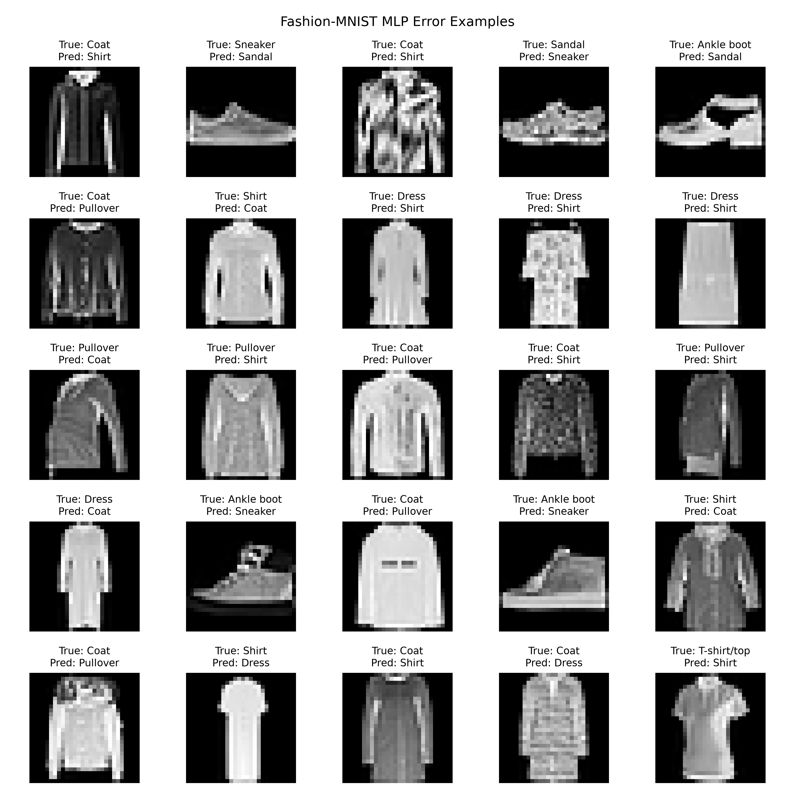

学习消融实验、参数对比、数据增强对比、类别级准确率、混淆矩阵、错误样例分析。
# 消融实验（Ablation Study）
## 核心：把模型中的某个东西拿掉，看性能会怎么变化。
例如我们现在的项目
原模型：卷积层 + ReLU + Pooling + Dropout

做消融实验：
去掉 Dropout → 重新训练 → 比较准确率

## 目的： **“这个设计到底有没有用？”**
但需要注意的是，它和普通的参数对比不完全一样。消融更强调**验证某个组件、机制或设计的作用**。

# 参数对比 / 超参数对比

## 核心：改变训练时人为设定的参数，看哪个效果更好。

# 数据增强对比
## 核心：比较“增加训练数据变化”到底有没有帮助。

经典数据增强路径
```
原始图片
↓
随机水平翻转
↓
随机旋转
↓
变成新的图片
```
# 类别级准确率（Per-class Accuracy）
普通的准确率：所有测试图片中，模型总体预测正确的比例。
这个数字看不出来：**模型到底擅长哪些类别？**
所以进一步分别计算：
```
T-shirt/top    82%
Trouser        98%
Pullover       84%
Dress          91%
Coat           80%
...
```
这就是**类别级准确率**。
# 混淆矩阵（Confusion Matrix）
见以前的note，

# 错误样例分析（Error Analysis）
## 核心：**“为什么这些具体图片会被预测错？”**

比如错误图片示例：
```
真实：Shirt
预测：T-shirt/top
```
然后观察图片，可能发现：
- 图片本身比较模糊
- 衣服轮廓不完整
- 两个类别视觉上非常相似
- 关键特征位于很小的区域
- 图片存在一定歧义
因此错误样例分析回答的是：**“模型错在哪里，以及为什么可能会错？”**
# 为了进行错误样例分析而进行的代码改造
增加：
error_images = []
error_labels = []
error_predictions = []
用于记录错误相关数据最后用于输出
增加：
```
		# =========================
        # 保存错误样例
        # =========================

        wrong = predictions != labels

        error_images.extend(
            images[wrong].cpu()
        )

        error_labels.extend(
            labels[wrong].cpu().numpy()
        )

        error_predictions.extend(
            predictions[wrong].cpu().numpy()
        )
```
用于保存错误样例
增加：
```
# =========================
# 错误样例可视化
# =========================

num_examples = min(
    25,
    len(error_images)
)

fig, axes = plt.subplots(
    5,
    5,
    figsize=(10, 10)
)

for i in range(num_examples):

    ax = axes[i // 5, i % 5]

    image = error_images[i].squeeze()

    ax.imshow(
        image,
        cmap="gray"
    )

    ax.set_title(
        f"True: {class_names[error_labels[i]]}\n"
        f"Pred: {class_names[error_predictions[i]]}",
        fontsize=9
    )

    ax.axis("off")


# 如果错误样例不足25张
for i in range(num_examples, 25):
    axes[i // 5, i % 5].axis("off")


plt.suptitle(
    "Fashion-MNIST MLP Error Examples"
)

plt.tight_layout()


plt.savefig(
    ERROR_EXAMPLES_PATH,
    dpi=300
)


plt.show()
```
用于绘制最后作为文件保存的错误样例：



# 一、实验一：MLP vs CNN

## 目的

回答：**对于 Fashion-MNIST 图像分类，CNN 是否比结构相对简单的 MLP 更适合处理图像？** 
## 实验设置
保持其他条件尽可能一致：

|项目|MLP|CNN|
|---|---|---|
|数据集|Fashion-MNIST|Fashion-MNIST|
|Train|5000|5000|
|Validation|1000|1000|
|Test|10000|10000|
|Epoch|5|5|
|Batch Size|64|64|
|Learning Rate|0.001|0.001|
|Optimizer|Adam|Adam|
|Loss|CrossEntropyLoss|CrossEntropyLoss|
MLP 结构：

```text
28×28
 ↓
Flatten
 ↓
Linear(784 → 128)
 ↓
ReLU
 ↓
Linear(128 → 64)
 ↓
ReLU
 ↓
Linear(64 → 10)
```
mlp模型结构：
```
class FashionMLP(nn.Module):
    def __init__(self, num_classes=10):
        super().__init__()

        self.network = nn.Sequential(
            nn.Flatten(),

            nn.Linear(28 * 28, 128),
            nn.ReLU(),

            nn.Linear(128, 64),
            nn.ReLU(),

            nn.Linear(64, num_classes)
        )
```
## 实验记录
### 终端


### 混淆矩阵和错误样例分析


## 总结分析
 CNN 的绝大部分测试准确率高于 MLP，这说明卷积结构能够更有效地利用图像的局部空间特征，因此更适合 Fashion-MNIST 图像分类任务。

# 二、实验二：无数据增强 vs 有数据增强

CNN baseline  
	↓  
一个不改变  
	↓  
一个加入数据增强


## 无增强
```text
Random/固定划分
	↓
ToTensor
	↓
Normalize
```

## 有增强

```text
Random/固定划分
	↓
transforms.RandomHorizontalFlip(),
transforms.RandomRotation(10),
	↓
ToTensor
	↓
Normalize
```
总结：
```text
训练集：增强
验证集：不增强
测试集：不增强
```
### 实验设置

|项目|无增强|有增强|
|---|---|---|
|模型|CNN|CNN|
|Train|5000|5000|
|Validation|1000|1000|
|Batch Size|64|64|
|LR|0.001|0.001|
|Epoch|5|5|
|Optimizer|Adam|Adam|

**唯一变量：数据增强。**
## 实验记录
### 终端


### 混淆矩阵和错误样例分析


## 总结分析
虽然增强后的训练准确率下降，但验证准确率上升，这说明：
数据增强可能降低了过拟合，提高了泛化能力。

# 迁移学习
```text
ImageNet pretrained ResNet18
            ↓
        修改最后 FC
            ↓
       10 classes
            ↓
       Fashion-MNIST
```

## 最大问题：Fashion-MNIST 是 28×28 灰度图

ImageNet ResNet18 通常接受：

```text
224 × 224 × 3
```

所以需要：
```text
28×28 grayscale
       ↓
Resize 224×224
       ↓
Gray → 3 channels
       ↓
ImageNet Normalize
       ↓
ResNet18
```
### model.py
```
import torch.nn as nn
from torchvision.models import resnet18, ResNet18_Weights

def get_transfer_model(num_classes=10):

    # =========================
    # 加载 ImageNet 预训练 ResNet18
    # =========================

    model = resnet18(
        weights=ResNet18_Weights.DEFAULT
    )


    # =========================
    # 冻结特征提取层
    # =========================

    for param in model.parameters():

        param.requires_grad = False


    # =========================
    # 替换最后分类层
    # =========================

    num_features = model.fc.in_features

    model.fc = nn.Linear(
        num_features,
        num_classes
    )

    return model
```
## 实验记录
### 终端


### 混淆矩阵和错误样例分析


## 总结分析
- **验证集准确率没有大幅度变动**
- **整体正确率小幅度下降**
- **测试准确率下降**
迁移学习后，验证集准确率整体没有明显变化，但整体正确率和测试集准确率均出现小幅下降。说明在本实验条件下，迁移学习没有带来明显的性能提升，反而使模型的泛化表现略有下降。可能与预训练数据和 Fashion-MNIST 存在较大的领域差异有关。